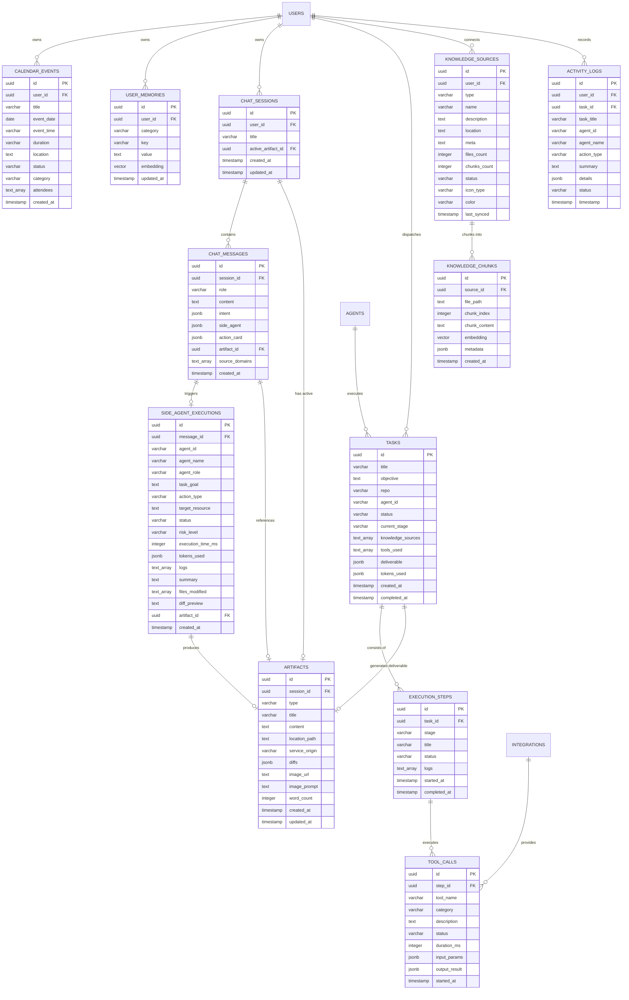

# Entity Relationship Diagram (ERD) & Database Specification: ContextForge

> **ContextForge Backend Database Architecture**  
> Database Engine: **PostgreSQL 16+ / Google Cloud SQL**  
> Extensions: `uuid-ossp` (UUID v4 Generation), `vector` (`pgvector` for Semantic RAG)  
> Data Access Pattern: **Native SQL via Node `pg` Pool (Zero ORM overhead)**

---

## 1. Visual Entity Relationship Diagram (Mermaid)



---

## 2. Definisi Struktur Tabel (Data Dictionary)

### 2.1 Domain Percakapan & Konten (Chat & Artifacts)

#### A. Tabel `chat_sessions`
Menyimpan riwayat sesi obrolan antara user dan AI.

| Kolom | Tipe Data | Constraint | Keterangan |
| :--- | :--- | :--- | :--- |
| `id` | `UUID` | `PRIMARY KEY`, Default `uuid_generate_v4()` | ID unik sesi chat |
| `user_id` | `UUID` | `NULLABLE` (Default Dev User) | Kepemilikan sesi |
| `title` | `VARCHAR(255)` | `NOT NULL` | Judul sesi (auto-generated dari prompt pertama) |
| `active_artifact_id` | `UUID` | `NULLABLE` | ID artifact yang sedang dibuka di Aside Panel |
| `created_at` | `TIMESTAMPTZ` | Default `NOW()` | Waktu sesi dibuat |
| `updated_at` | `TIMESTAMPTZ` | Default `NOW()` | Waktu update interaksi terakhir |

#### B. Tabel `chat_messages`
Menyimpan setiap pesan dalam sesi obrolan beserta metadata intent dan sitasi.

| Kolom | Tipe Data | Constraint | Keterangan |
| :--- | :--- | :--- | :--- |
| `id` | `UUID` | `PRIMARY KEY`, Default `uuid_generate_v4()` | ID unik pesan |
| `session_id` | `UUID` | `NOT NULL`, `REFERENCES chat_sessions(id) ON DELETE CASCADE` | ID sesi induk |
| `role` | `VARCHAR(20)` | `NOT NULL`, `CHECK (role IN ('user', 'assistant', 'system'))` | Peran pengirim |
| `content` | `TEXT` | `NOT NULL` | Isi teks pesan (Markdown) |
| `intent` | `JSONB` | `NULLABLE` | Metadata intent (`toolName`, `service`, `status`, `summaryText`) |
| `side_agent` | `JSONB` | `NULLABLE` | Snapshot eksekusi worker terisolasi |
| `action_card` | `JSONB` | `NULLABLE` | Payload Action Card interaktif di chat |
| `artifact_id` | `UUID` | `NULLABLE`, `REFERENCES artifacts(id) ON DELETE SET NULL` | Relasi ke dokumen/diff di Aside Panel |
| `source_domains` | `TEXT[]` | `NULLABLE` | Array domain sitasi hasil live search |
| `created_at` | `TIMESTAMPTZ` | Default `NOW()` | Timestamp pesan dikirim |

#### C. Tabel `artifacts`
Menyimpan dokumen markdown, kode diff, visual assets yang dibuka di Context Aside.

| Kolom | Tipe Data | Constraint | Keterangan |
| :--- | :--- | :--- | :--- |
| `id` | `UUID` | `PRIMARY KEY`, Default `uuid_generate_v4()` | ID unik artifact |
| `session_id` | `UUID` | `NULLABLE`, `REFERENCES chat_sessions(id) ON DELETE SET NULL` | Sesi terkait |
| `type` | `VARCHAR(50)` | `NOT NULL`, `CHECK (type IN ('markdown_doc', 'code_patch', 'reminder_event', 'search_synthesis', 'image_asset'))` | Jenis dokumen artifact |
| `title` | `VARCHAR(255)` | `NOT NULL` | Judul dokumen |
| `content` | `TEXT` | `NOT NULL` | Isi teks / Markdown dokumen |
| `location_path` | `TEXT` | `NULLABLE` | Path file target di repository/vault |
| `service_origin` | `VARCHAR(50)` | `NULLABLE` (`obsidian`, `github`, `web`, `calendar`, `imagen`) | Layanan asal |
| `diffs` | `JSONB` | `NULLABLE` | Detail line additions/deletions diff kode |
| `image_url` | `TEXT` | `NULLABLE` | URL / inline SVG / Cloud Storage path |
| `image_prompt` | `TEXT` | `NULLABLE` | Prompt asli saat generate gambar |
| `word_count` | `INTEGER` | Default `0` | Total jumlah kata |
| `created_at` | `TIMESTAMPTZ` | Default `NOW()` | Waktu pembuatan |
| `updated_at` | `TIMESTAMPTZ` | Default `NOW()` | Waktu update dokumen terakhir |

---

### 2.2 Domain Eksekusi Agent & Side Workers

#### A. Tabel `side_agent_executions`
Menyimpan riwayat kerja ephemeral worker yang didelegasikan oleh Core Orchestrator.

| Kolom | Tipe Data | Constraint | Keterangan |
| :--- | :--- | :--- | :--- |
| `id` | `UUID` | `PRIMARY KEY`, Default `uuid_generate_v4()` | ID unik eksekusi |
| `message_id` | `UUID` | `NULLABLE`, `REFERENCES chat_messages(id) ON DELETE SET NULL` | Pesan pemicu |
| `agent_id` | `VARCHAR(100)` | `NOT NULL` | ID agent worker (e.g. `agent-doc-crawl`) |
| `agent_name` | `VARCHAR(150)` | `NOT NULL` | Nama display agent |
| `agent_role` | `VARCHAR(150)` | `NOT NULL` | Role agent |
| `task_goal` | `TEXT` | `NOT NULL` | Deskripsi tujuan tugas |
| `action_type` | `VARCHAR(50)` | `NOT NULL` (`obsidian_write`, `create_file`, `calendar_schedule`, etc.) | Tipe aksi mutasi |
| `target_resource` | `TEXT` | `NOT NULL` | File path atau endpoint API target |
| `status` | `VARCHAR(30)` | `NOT NULL`, `CHECK (status IN ('queued', 'running', 'completed', 'failed'))` | Status eksekusi |
| `risk_level` | `VARCHAR(20)` | `NOT NULL`, `CHECK (risk_level IN ('low_risk', 'medium_risk', 'high_risk'))` | Tingkat risiko (HITL check) |
| `execution_time_ms`| `INTEGER` | Default `0` | Durasi eksekusi dalam milidetik |
| `tokens_used` | `JSONB` | `NULLABLE` (`{ input: 240, output: 95 }`) | Jumlah token terpakai |
| `logs` | `TEXT[]` | Default `'{}'` | Baris log eksekusi terminal/worker |
| `summary` | `TEXT` | `NOT NULL` | Ringkasan hasil kerja |
| `files_modified` | `TEXT[]` | `NULLABLE` | Daftar file yang dimutasi |
| `diff_preview` | `TEXT` | `NULLABLE` | Cuplikan kode diff perubahan |
| `artifact_id` | `UUID` | `NULLABLE`, `REFERENCES artifacts(id) ON DELETE SET NULL` | Artifact output yang dihasilkan |
| `created_at` | `TIMESTAMPTZ` | Default `NOW()` | Waktu eksekusi dimulai |

#### B. Tabel `tasks`, `execution_steps`, & `tool_calls`
Mendukung pelacakan task berjenjang untuk modul *Tasks & Activity*.

| Tabel | Kolom Kunci | Relasi & Deskripsi |
| :--- | :--- | :--- |
| `tasks` | `id`, `title`, `objective`, `repo`, `agent_id`, `status`, `current_stage`, `deliverable (JSONB)`, `tokens_used (JSONB)` | Task besar yang memiliki deliverable (PR, RFC, Patch) |
| `execution_steps` | `id`, `task_id (FK)`, `stage`, `title`, `status`, `logs (TEXT[])`, `started_at`, `completed_at` | Tahapan eksekusi task (`planning`, `context_retrieval`, dll.) |
| `tool_calls` | `id`, `step_id (FK)`, `tool_name`, `category`, `status`, `duration_ms`, `input_params (JSONB)`, `output_result (JSONB)` | Panggilan tool konkret (Web search, GitHub API, AST parse) |

---

### 2.3 Domain Personal Hub (Schedule & Long-Term Memories)

#### A. Tabel `calendar_events`
Menyimpan jadwal agenda dan reminder harian pengguna.

| Kolom | Tipe Data | Constraint | Keterangan |
| :--- | :--- | :--- | :--- |
| `id` | `UUID` | `PRIMARY KEY`, Default `uuid_generate_v4()` | ID event kalender |
| `user_id` | `UUID` | `NULLABLE` | ID user pemilik |
| `title` | `VARCHAR(255)` | `NOT NULL` | Judul kegiatan / meeting |
| `event_date` | `DATE` | `NOT NULL` | Tanggal kegiatan (`YYYY-MM-DD`) |
| `event_time` | `VARCHAR(20)` | `NOT NULL` | Waktu kegiatan (e.g. `09:00 AM`) |
| `duration` | `VARCHAR(50)` | Default `'30m'` | Estimasi durasi (e.g. `45 mins`, `1h`) |
| `location` | `TEXT` | `NULLABLE` | Lokasi / Link Google Meet |
| `status` | `VARCHAR(30)` | `NOT NULL`, Default `'upcoming'`, `CHECK (status IN ('upcoming', 'in_progress', 'completed'))` | Status event |
| `category` | `VARCHAR(30)` | `NOT NULL`, Default `'task'`, `CHECK (category IN ('meeting', 'task', 'review', 'personal'))` | Kategori event |
| `attendees` | `TEXT[]` | `NULLABLE` | Daftar partisipan kegiatan |
| `created_at` | `TIMESTAMPTZ` | Default `NOW()` | Waktu pembuatan event |

#### B. Tabel `user_memories`
Menyimpan preferensi, profil, dan aturan kerja jangka panjang dengan dukungan Vector RAG.

| Kolom | Tipe Data | Constraint | Keterangan |
| :--- | :--- | :--- | :--- |
| `id` | `UUID` | `PRIMARY KEY`, Default `uuid_generate_v4()` | ID memori |
| `user_id` | `UUID` | `NULLABLE` | ID user |
| `category` | `VARCHAR(50)` | `NOT NULL`, `CHECK (category IN ('profile', 'preference', 'project', 'workflow'))` | Kategori memori |
| `key` | `VARCHAR(100)` | `NOT NULL` | Kata kunci memori (e.g. `preferred_stack`) |
| `value` | `TEXT` | `NOT NULL` | Isi detail memori |
| `embedding` | `VECTOR(768)` | `NULLABLE` | Vector embedding untuk semantic retrieval |
| `updated_at` | `TIMESTAMPTZ` | Default `NOW()` | Waktu update terakhir |

---

### 2.4 Domain Multi-Source Knowledge Ingestion (`pgvector`)

#### A. Tabel `knowledge_sources`
Menyimpan metadata sumber data yang terhubung (Obsidian Vault, GitHub Repo, Notion, OpenAPI, Postgres Schema).

| Kolom | Tipe Data | Constraint | Keterangan |
| :--- | :--- | :--- | :--- |
| `id` | `UUID` | `PRIMARY KEY`, Default `uuid_generate_v4()` | ID sumber pengetahuan |
| `type` | `VARCHAR(50)` | `NOT NULL` | Tipe sumber (`obsidian_vault`, `github_repo`, dll.) |
| `name` | `VARCHAR(255)` | `NOT NULL` | Nama sumber |
| `description` | `TEXT` | `NULLABLE` | Deskripsi isi pengetahuan |
| `location` | `TEXT` | `NOT NULL` | Path direktori lokal atau URL remote |
| `meta` | `TEXT` | `NULLABLE` | Metadata tambahan |
| `files_count` | `INTEGER` | Default `0` | Jumlah file terindeks |
| `chunks_count` | `INTEGER` | Default `0` | Total potongan vektor |
| `status` | `VARCHAR(30)` | Default `'synced'`, `CHECK (status IN ('synced', 'syncing', 'error'))` | Status sinkronisasi |
| `icon_type` | `VARCHAR(50)` | Default `'file'` | Tipe ikon di frontend |
| `color` | `VARCHAR(50)` | Default `'text-primary'` | Warna aksen UI |
| `last_synced` | `TIMESTAMPTZ` | Default `NOW()` | Waktu sync terakhir |

#### B. Tabel `knowledge_chunks`
Menyimpan teks pecahan dokumen beserta vektor embedding untuk pencarian RAG (Retrieval-Augmented Generation).

| Kolom | Tipe Data | Constraint | Keterangan |
| :--- | :--- | :--- | :--- |
| `id` | `UUID` | `PRIMARY KEY`, Default `uuid_generate_v4()` | ID unik chunk |
| `source_id` | `UUID` | `NOT NULL`, `REFERENCES knowledge_sources(id) ON DELETE CASCADE` | ID sumber induk |
| `file_path` | `TEXT` | `NOT NULL` | Path file spesifik dokumen |
| `chunk_index` | `INTEGER` | `NOT NULL` | Urutan potongan dalam dokumen |
| `chunk_content`| `TEXT` | `NOT NULL` | Teks mentah potongan |
| `embedding` | `VECTOR(768)` | `NOT NULL` | Vektor embedding (Gemini Embedding / text-embedding-004) |
| `metadata` | `JSONB` | `NULLABLE` | Metadata header/tags/frontmatter |
| `created_at` | `TIMESTAMPTZ` | Default `NOW()` | Waktu indeks dibuat |

---

### 2.5 Domain Telemetri & Audit Log (`activity_logs`)

| Kolom | Tipe Data | Constraint | Keterangan |
| :--- | :--- | :--- | :--- |
| `id` | `UUID` | `PRIMARY KEY`, Default `uuid_generate_v4()` | ID log audit |
| `timestamp` | `TIMESTAMPTZ` | Default `NOW()` | Waktu kejadian |
| `task_id` | `UUID` | `NULLABLE` | ID Task terkait |
| `task_title` | `VARCHAR(255)` | `NULLABLE` | Judul Task terkait |
| `agent_id` | `VARCHAR(100)` | `NOT NULL` | ID Agent pelaksana |
| `agent_name` | `VARCHAR(150)` | `NOT NULL` | Nama Agent pelaksana |
| `action_type` | `VARCHAR(100)` | `NOT NULL` | Tipe aksi telemetri |
| `summary` | `TEXT` | `NOT NULL` | Ringkasan log yang human-readable |
| `details` | `JSONB` | `NULLABLE` | Payload teknis / input / output |
| `status` | `VARCHAR(20)` | Default `'info'`, `CHECK (status IN ('info', 'success', 'warning', 'error'))` | Status audit |

---

## 3. DDL Skrip Lengkap Native PostgreSQL (`schema.sql`)

Skrip SQL berikut siap dieksekusi langsung pada PostgreSQL / Google Cloud SQL:

```sql
-- =====================================================================
-- ContextForge: Native PostgreSQL Schema Definition
-- Engine: PostgreSQL 16+ with pgvector & uuid-ossp
-- =====================================================================

-- 1. Inisialisasi Ekstensi Wajib
CREATE EXTENSION IF NOT EXISTS "uuid-ossp";
CREATE EXTENSION IF NOT EXISTS "vector";

-- 2. Entitas Sesi & Pesan Percakapan
CREATE TABLE IF NOT EXISTS chat_sessions (
    id UUID PRIMARY KEY DEFAULT uuid_generate_v4(),
    user_id UUID,
    title VARCHAR(255) NOT NULL,
    active_artifact_id UUID,
    created_at TIMESTAMPTZ DEFAULT NOW(),
    updated_at TIMESTAMPTZ DEFAULT NOW()
);

CREATE TABLE IF NOT EXISTS artifacts (
    id UUID PRIMARY KEY DEFAULT uuid_generate_v4(),
    session_id UUID REFERENCES chat_sessions(id) ON DELETE SET NULL,
    type VARCHAR(50) NOT NULL CHECK (type IN ('markdown_doc', 'code_patch', 'reminder_event', 'search_synthesis', 'image_asset')),
    title VARCHAR(255) NOT NULL,
    content TEXT NOT NULL,
    location_path TEXT,
    service_origin VARCHAR(50),
    diffs JSONB,
    image_url TEXT,
    image_prompt TEXT,
    word_count INTEGER DEFAULT 0,
    created_at TIMESTAMPTZ DEFAULT NOW(),
    updated_at TIMESTAMPTZ DEFAULT NOW()
);

-- Foreign Key sirkular aman: Update chat_sessions ref ke artifacts
ALTER TABLE chat_sessions 
    DROP CONSTRAINT IF EXISTS fk_active_artifact,
    ADD CONSTRAINT fk_active_artifact FOREIGN KEY (active_artifact_id) REFERENCES artifacts(id) ON DELETE SET NULL;

CREATE TABLE IF NOT EXISTS chat_messages (
    id UUID PRIMARY KEY DEFAULT uuid_generate_v4(),
    session_id UUID NOT NULL REFERENCES chat_sessions(id) ON DELETE CASCADE,
    role VARCHAR(20) NOT NULL CHECK (role IN ('user', 'assistant', 'system')),
    content TEXT NOT NULL,
    intent JSONB,
    side_agent JSONB,
    action_card JSONB,
    artifact_id UUID REFERENCES artifacts(id) ON DELETE SET NULL,
    source_domains TEXT[],
    created_at TIMESTAMPTZ DEFAULT NOW()
);

-- 3. Entitas Side Agent & Task Orchestration
CREATE TABLE IF NOT EXISTS side_agent_executions (
    id UUID PRIMARY KEY DEFAULT uuid_generate_v4(),
    message_id UUID REFERENCES chat_messages(id) ON DELETE SET NULL,
    agent_id VARCHAR(100) NOT NULL,
    agent_name VARCHAR(150) NOT NULL,
    agent_role VARCHAR(150) NOT NULL,
    task_goal TEXT NOT NULL,
    action_type VARCHAR(50) NOT NULL,
    target_resource TEXT NOT NULL,
    status VARCHAR(30) NOT NULL CHECK (status IN ('queued', 'running', 'completed', 'failed')),
    risk_level VARCHAR(20) NOT NULL CHECK (risk_level IN ('low_risk', 'medium_risk', 'high_risk')),
    execution_time_ms INTEGER DEFAULT 0,
    tokens_used JSONB,
    logs TEXT[] DEFAULT '{}',
    summary TEXT NOT NULL,
    files_modified TEXT[],
    diff_preview TEXT,
    artifact_id UUID REFERENCES artifacts(id) ON DELETE SET NULL,
    created_at TIMESTAMPTZ DEFAULT NOW()
);

CREATE TABLE IF NOT EXISTS tasks (
    id UUID PRIMARY KEY DEFAULT uuid_generate_v4(),
    title VARCHAR(255) NOT NULL,
    objective TEXT NOT NULL,
    repo VARCHAR(255) DEFAULT '',
    agent_id VARCHAR(100) NOT NULL,
    status VARCHAR(30) NOT NULL CHECK (status IN ('queued', 'planning', 'running_tools', 'analyzing', 'waiting_approval', 'completed', 'failed')),
    current_stage VARCHAR(30) NOT NULL CHECK (current_stage IN ('planning', 'context_retrieval', 'tool_execution', 'validation', 'deliverable')),
    knowledge_sources TEXT[] DEFAULT '{}',
    tools_used TEXT[] DEFAULT '{}',
    deliverable JSONB,
    tokens_used JSONB,
    created_at TIMESTAMPTZ DEFAULT NOW(),
    completed_at TIMESTAMPTZ
);

CREATE TABLE IF NOT EXISTS execution_steps (
    id UUID PRIMARY KEY DEFAULT uuid_generate_v4(),
    task_id UUID NOT NULL REFERENCES tasks(id) ON DELETE CASCADE,
    stage VARCHAR(30) NOT NULL,
    title VARCHAR(255) NOT NULL,
    status VARCHAR(30) NOT NULL CHECK (status IN ('pending', 'in_progress', 'completed', 'failed')),
    logs TEXT[] DEFAULT '{}',
    started_at TIMESTAMPTZ DEFAULT NOW(),
    completed_at TIMESTAMPTZ
);

CREATE TABLE IF NOT EXISTS tool_calls (
    id UUID PRIMARY KEY DEFAULT uuid_generate_v4(),
    step_id UUID NOT NULL REFERENCES execution_steps(id) ON DELETE CASCADE,
    tool_name VARCHAR(100) NOT NULL,
    category VARCHAR(50) NOT NULL,
    description TEXT,
    status VARCHAR(30) NOT NULL CHECK (status IN ('running', 'success', 'error')),
    duration_ms INTEGER DEFAULT 0,
    input_params JSONB,
    output_result JSONB,
    started_at TIMESTAMPTZ DEFAULT NOW()
);

-- 4. Entitas Personal Hub (Schedule & Memories)
CREATE TABLE IF NOT EXISTS calendar_events (
    id UUID PRIMARY KEY DEFAULT uuid_generate_v4(),
    user_id UUID,
    title VARCHAR(255) NOT NULL,
    event_date DATE NOT NULL,
    event_time VARCHAR(20) NOT NULL,
    duration VARCHAR(50) DEFAULT '30m',
    location TEXT,
    status VARCHAR(30) NOT NULL DEFAULT 'upcoming' CHECK (status IN ('upcoming', 'in_progress', 'completed')),
    category VARCHAR(30) NOT NULL DEFAULT 'task' CHECK (category IN ('meeting', 'task', 'review', 'personal')),
    attendees TEXT[] DEFAULT '{}',
    created_at TIMESTAMPTZ DEFAULT NOW()
);

CREATE TABLE IF NOT EXISTS user_memories (
    id UUID PRIMARY KEY DEFAULT uuid_generate_v4(),
    user_id UUID,
    category VARCHAR(50) NOT NULL CHECK (category IN ('profile', 'preference', 'project', 'workflow')),
    key VARCHAR(100) NOT NULL,
    value TEXT NOT NULL,
    embedding VECTOR(768),
    updated_at TIMESTAMPTZ DEFAULT NOW()
);

-- 5. Entitas Multi-Source Knowledge & pgvector
CREATE TABLE IF NOT EXISTS knowledge_sources (
    id UUID PRIMARY KEY DEFAULT uuid_generate_v4(),
    user_id UUID,
    type VARCHAR(50) NOT NULL,
    name VARCHAR(255) NOT NULL,
    description TEXT,
    location TEXT NOT NULL,
    meta TEXT,
    files_count INTEGER DEFAULT 0,
    chunks_count INTEGER DEFAULT 0,
    status VARCHAR(30) NOT NULL DEFAULT 'synced' CHECK (status IN ('synced', 'syncing', 'error')),
    icon_type VARCHAR(50) DEFAULT 'file',
    color VARCHAR(50) DEFAULT 'text-primary',
    last_synced TIMESTAMPTZ DEFAULT NOW()
);

CREATE TABLE IF NOT EXISTS knowledge_chunks (
    id UUID PRIMARY KEY DEFAULT uuid_generate_v4(),
    source_id UUID NOT NULL REFERENCES knowledge_sources(id) ON DELETE CASCADE,
    file_path TEXT NOT NULL,
    chunk_index INTEGER NOT NULL,
    chunk_content TEXT NOT NULL,
    embedding VECTOR(768) NOT NULL,
    metadata JSONB,
    created_at TIMESTAMPTZ DEFAULT NOW()
);

-- 6. Entitas Activity Telemetry & Audit Logs
CREATE TABLE IF NOT EXISTS activity_logs (
    id UUID PRIMARY KEY DEFAULT uuid_generate_v4(),
    user_id UUID,
    timestamp TIMESTAMPTZ DEFAULT NOW(),
    task_id UUID,
    task_title VARCHAR(255),
    agent_id VARCHAR(100) NOT NULL,
    agent_name VARCHAR(150) NOT NULL,
    action_type VARCHAR(100) NOT NULL,
    summary TEXT NOT NULL,
    details JSONB,
    status VARCHAR(20) NOT NULL DEFAULT 'info' CHECK (status IN ('info', 'success', 'warning', 'error'))
);

-- =====================================================================
-- 7. Performance & Vector Indexing
-- =====================================================================

-- Indeks Relasional Standar
CREATE INDEX IF NOT EXISTS idx_chat_messages_session ON chat_messages(session_id, created_at ASC);
CREATE INDEX IF NOT EXISTS idx_artifacts_session ON artifacts(session_id);
CREATE INDEX IF NOT EXISTS idx_execution_steps_task ON execution_steps(task_id);
CREATE INDEX IF NOT EXISTS idx_tool_calls_step ON tool_calls(step_id);
CREATE INDEX IF NOT EXISTS idx_calendar_events_date ON calendar_events(event_date, status);
CREATE INDEX IF NOT EXISTS idx_activity_logs_time ON activity_logs(timestamp DESC);

-- Indeks Vector Cosine Similarity (HNSW) untuk Fast Semantic RAG
CREATE INDEX IF NOT EXISTS idx_knowledge_chunks_embedding 
    ON knowledge_chunks USING hnsw (embedding vector_cosine_ops);

CREATE INDEX IF NOT EXISTS idx_user_memories_embedding 
    ON user_memories USING hnsw (embedding vector_cosine_ops);
```

---

## 4. Pola Akses Data Native SQL di NestJS (Contoh Pola Repository)

Tanpa ORM, implementasi query dieksekusi langsung melalui wrapper `DatabaseService`:

```typescript
// Contoh Query Type-Safe Menggunakan pg.Pool
@Injectable()
export class ChatRepository {
  constructor(private readonly db: DatabaseService) {}

  // 1. Fetch riwayat chat dengan intent dan artifact terkait
  async getSessionMessages(sessionId: string): Promise<ChatMessageRow[]> {
    const query = `
      SELECT 
        m.id, m.role, m.content, m.intent, m.side_agent, m.action_card,
        m.source_domains, m.created_at, m.artifact_id,
        a.title AS artifact_title, a.type AS artifact_type
      FROM chat_messages m
      LEFT JOIN artifacts a ON m.artifact_id = a.id
      WHERE m.session_id = $1
      ORDER BY m.created_at ASC;
    `;
    const result = await this.db.query<ChatMessageRow>(query, [sessionId]);
    return result.rows;
  }

  // 2. Fast Semantic Similarity Search via pgvector
  async searchKnowledgeVectors(embeddingVector: number[], limit = 5): Promise<KnowledgeChunkMatch[]> {
    const query = `
      SELECT 
        c.id, c.file_path, c.chunk_content, c.metadata,
        s.name AS source_name,
        1 - (c.embedding <=> $1::vector) AS similarity_score
      FROM knowledge_chunks c
      JOIN knowledge_sources s ON c.source_id = s.id
      ORDER BY c.embedding <=> $1::vector ASC
      LIMIT $2;
    `;
    const result = await this.db.query<KnowledgeChunkMatch>(query, [
      JSON.stringify(embeddingVector),
      limit,
    ]);
    return result.rows;
  }
}
```
