# Entity Relationship Diagram (ERD) & Database Specification: ContextForge

> **Document Version:** 2.0.0  
> **Database Engine:** PostgreSQL 16+ / Google Cloud SQL  
> **Extensions:** `uuid-ossp` (UUID v4), `pgcrypto` (Kredensial Vault Enkripsi), `vector` (`pgvector` untuk Semantic RAG)  
> **Data Access Pattern:** Native SQL via Node `pg` Pool (Zero ORM overhead)

---

## 1. Visual Entity Relationship Diagram (Mermaid)

```mermaid
erDiagram
    %% 1. Core Conversational & Artifact Domain
    CHAT_SESSIONS ||--o{ CHAT_MESSAGES : "contains"
    CHAT_MESSAGES ||--o| SIDE_AGENT_EXECUTIONS : "triggers"
    CHAT_MESSAGES ||--o| ARTIFACTS : "references"
    CHAT_SESSIONS ||--o| ARTIFACTS : "has active"

    %% 2. Agentic Task & Execution Domain
    TASKS ||--o{ EXECUTION_STEPS : "consists of"
    EXECUTION_STEPS ||--o{ TOOL_CALLS : "executes"
    TASKS ||--o| ARTIFACTS : "generates deliverable"
    SIDE_AGENT_EXECUTIONS ||--o| ARTIFACTS : "produces"

    %% 3. Knowledge & Vector Domain (1. Knowledge)
    KNOWLEDGE_SOURCES ||--o{ KNOWLEDGE_CHUNKS : "chunks into"

    %% 4. Personal Hub Domain
    USERS ||--o{ CALENDAR_EVENTS : "owns"
    USERS ||--o{ USER_MEMORIES : "owns"
    USERS ||--o{ CHAT_SESSIONS : "owns"
    USERS ||--o{ TASKS : "dispatches"
    USERS ||--o{ KNOWLEDGE_SOURCES : "connects"
    USERS ||--o{ ACTIVITY_LOGS : "records"
    USERS ||--o{ WORKSPACE_CONNECTIONS : "configures"

    %% 5. Ecosystem Domain (2. MCP, 3. Skill, 4. Connection, 5. Agent)
    WORKSPACE_AGENTS ||--o{ TASKS : "executes"
    WORKSPACE_INTEGRATIONS ||--o{ TOOL_CALLS : "provides tool"
    WORKSPACE_CONNECTIONS ||--o{ WORKSPACE_INTEGRATIONS : "authenticates"
    WORKSPACE_CONNECTIONS ||--o{ WORKSPACE_AGENTS : "powers reasoning"

    CHAT_SESSIONS {
        uuid id PK
        uuid user_id FK
        varchar title
        uuid active_artifact_id FK
        timestamp created_at
        timestamp updated_at
    }

    CHAT_MESSAGES {
        uuid id PK
        uuid session_id FK
        varchar role
        text content
        jsonb intent
        jsonb side_agent
        jsonb action_card
        uuid artifact_id FK
        text_array source_domains
        timestamp created_at
    }

    ARTIFACTS {
        uuid id PK
        uuid session_id FK
        varchar type
        varchar title
        text content
        text location_path
        varchar service_origin
        jsonb diffs
        text image_url
        text image_prompt
        integer word_count
        timestamp created_at
        timestamp updated_at
    }

    SIDE_AGENT_EXECUTIONS {
        uuid id PK
        uuid message_id FK
        varchar agent_id
        varchar agent_name
        varchar agent_role
        text task_goal
        varchar action_type
        text target_resource
        varchar status
        varchar risk_level
        integer execution_time_ms
        jsonb tokens_used
        text_array logs
        text summary
        text_array files_modified
        text diff_preview
        uuid artifact_id FK
        timestamp created_at
    }

    TASKS {
        uuid id PK
        varchar title
        text objective
        varchar repo
        varchar agent_id
        varchar status
        varchar current_stage
        text_array knowledge_sources
        text_array tools_used
        jsonb deliverable
        jsonb tokens_used
        timestamp created_at
        timestamp completed_at
    }

    EXECUTION_STEPS {
        uuid id PK
        uuid task_id FK
        varchar stage
        varchar title
        varchar status
        text_array logs
        timestamp started_at
        timestamp completed_at
    }

    TOOL_CALLS {
        uuid id PK
        uuid step_id FK
        varchar tool_name
        varchar category
        text description
        varchar status
        integer duration_ms
        jsonb input_params
        jsonb output_result
        timestamp started_at
    }

    CALENDAR_EVENTS {
        uuid id PK
        uuid user_id FK
        varchar title
        date event_date
        varchar event_time
        varchar duration
        text location
        varchar status
        varchar category
        text_array attendees
        timestamp created_at
    }

    USER_MEMORIES {
        uuid id PK
        uuid user_id FK
        varchar category
        varchar key
        text value
        vector embedding
        timestamp updated_at
    }

    KNOWLEDGE_SOURCES {
        uuid id PK
        uuid user_id FK
        varchar type
        varchar name
        text description
        text location
        text meta
        integer files_count
        integer chunks_count
        varchar status
        varchar icon_type
        varchar color
        timestamp last_synced
    }

    KNOWLEDGE_CHUNKS {
        uuid id PK
        uuid source_id FK
        text file_path
        integer chunk_index
        text chunk_content
        vector embedding
        jsonb metadata
        timestamp created_at
    }

    WORKSPACE_CONNECTIONS {
        varchar id PK
        uuid user_id FK
        varchar name
        varchar connection_type
        varchar provider
        varchar auth_type
        text endpoint_url
        jsonb config_encrypted
        varchar status
        boolean is_active
        timestamp created_at
        timestamp updated_at
    }

    WORKSPACE_AGENTS {
        varchar id PK
        varchar name
        varchar role
        varchar agent_type
        varchar permissions
        text description
        varchar avatar_color
        varchar model
        numeric temperature
        text system_prompt
        jsonb capabilities
        text_array assigned_tools
        text_array assigned_skills
        varchar status
        integer total_tasks_completed
        numeric success_rate_pct
        timestamp created_at
        timestamp updated_at
    }

    WORKSPACE_SKILLS {
        varchar id PK
        varchar name
        text description
        varchar category
        varchar icon
        text sop_summary
        text instructions
        text_array assigned_tools
        boolean enabled
        boolean is_custom
        timestamp created_at
        timestamp updated_at
    }

    WORKSPACE_INTEGRATIONS {
        varchar id PK
        varchar connection_id FK
        varchar name
        varchar category
        varchar status
        text endpoint
        varchar version
        varchar transport
        text description
        jsonb tools
        integer last_ping_ms
        integer latency_ms
        boolean is_custom
        timestamp created_at
        timestamp updated_at
    }

    ACTIVITY_LOGS {
        uuid id PK
        uuid user_id FK
        uuid task_id FK
        varchar task_title
        varchar agent_id
        varchar agent_name
        varchar action_type
        text summary
        jsonb details
        varchar status
        timestamp timestamp
    }
```



---

## 2. Definisi Struktur Tabel (Data Dictionary)

### 2.1 Domain Percakapan & Konten (Chat & Artifacts)

#### A. Tabel `chat_sessions`
Menyimpan riwayat sesi obrolan antara user dan AI.

| Kolom | Tipe Data | Constraint | Keterangan |
| :--- | :--- | :--- | :--- |
| `id` | `UUID` | `PRIMARY KEY`, Default `uuid_generate_v4()` | ID unik sesi chat |
| `user_id` | `UUID` | `NULLABLE` | Kepemilikan sesi |
| `title` | `VARCHAR(255)` | `NOT NULL` | Judul sesi (auto-generated dari prompt pertama) |
| `active_artifact_id` | `UUID` | `NULLABLE`, `FK -> artifacts(id)` | ID artifact yang sedang dibuka di Aside Panel |
| `created_at` | `TIMESTAMPTZ` | Default `NOW()` | Waktu pembuatan |
| `updated_at` | `TIMESTAMPTZ` | Default `NOW()` | Waktu update terakhir |

#### B. Tabel `chat_messages`
Menyimpan pesan individual, payload fungsi tool, intent, dan status side agent.

| Kolom | Tipe Data | Constraint | Keterangan |
| :--- | :--- | :--- | :--- |
| `id` | `UUID` | `PRIMARY KEY`, Default `uuid_generate_v4()` | ID unik pesan |
| `session_id` | `UUID` | `NOT NULL`, `FK -> chat_sessions(id) ON DELETE CASCADE` | Relasi ke sesi chat |
| `role` | `VARCHAR(20)` | `CHECK (role IN ('user', 'assistant', 'system'))` | Pengirim pesan |
| `content` | `TEXT` | `NOT NULL` | Isi pesan teks (Markdown) |
| `intent` | `JSONB` | `NULLABLE` | Metadata intent AI & badge ringkasan |
| `side_agent` | `JSONB` | `NULLABLE` | Snapshot status eksekusi worker |
| `action_card` | `JSONB` | `NULLABLE` | Kartu aksi interaktif (Obsidian, PR, Calendar) |
| `artifact_id` | `UUID` | `NULLABLE`, `FK -> artifacts(id) ON DELETE SET NULL` | Relasi dokumen deliverable |
| `source_domains` | `TEXT[]` | `NULLABLE` | Domain referensi pencarian web/RAG |
| `created_at` | `TIMESTAMPTZ` | Default `NOW()` | Timestamp pengiriman |

#### C. Tabel `artifacts`
Menyimpan dokumen Markdown, patch diff, event agenda, dan aset visual yang dirender di Aside Panel.

| Kolom | Tipe Data | Constraint | Keterangan |
| :--- | :--- | :--- | :--- |
| `id` | `UUID` | `PRIMARY KEY`, Default `uuid_generate_v4()` | ID unik artifact |
| `session_id` | `UUID` | `NULLABLE`, `FK -> chat_sessions(id) ON DELETE SET NULL` | Sesi tempat artifact dibuat |
| `type` | `VARCHAR(50)` | `CHECK (type IN ('markdown_doc', 'code_patch', 'reminder_event', 'search_synthesis', 'image_asset'))` | Kategori dokumen |
| `title` | `VARCHAR(255)` | `NOT NULL` | Judul dokumen/file |
| `content` | `TEXT` | `NOT NULL` | Isi teks dokumen mentah |
| `location_path` | `TEXT` | `NULLABLE` | Lokasi path file fisik (contoh: `Vault/Notes/auth.md`) |
| `service_origin` | `VARCHAR(50)` | `CHECK (service_origin IN ('obsidian', 'calendar', 'web', 'github', 'postgres', 'imagen'))` | Asal service penghasil |
| `diffs` | `JSONB` | `NULLABLE` | Array struktur perbandingan kode diff |
| `image_url` | `TEXT` | `NULLABLE` | URL gambar yang di-generate |
| `image_prompt` | `TEXT` | `NULLABLE` | Prompt pembuatan gambar |
| `word_count` | `INTEGER` | Default `0` | Jumlah kata |
| `created_at` | `TIMESTAMPTZ` | Default `NOW()` | Timestamp pembuatan |
| `updated_at` | `TIMESTAMPTZ` | Default `NOW()` | Timestamp pengeditan |

---

### 2.2 Domain Side Agent & Task Orchestration

#### A. Tabel `side_agent_executions`
Melacak eksekusi pekerja mandiri terisolasi (*ephemeral worker*).

| Kolom | Tipe Data | Constraint | Keterangan |
| :--- | :--- | :--- | :--- |
| `id` | `UUID` | `PRIMARY KEY`, Default `uuid_generate_v4()` | ID unik log eksekusi worker |
| `message_id` | `UUID` | `NULLABLE`, `FK -> chat_messages(id)` | Pesan pemicu |
| `agent_id` | `VARCHAR(100)` | `NOT NULL` | Identifier agen pekerja |
| `agent_name` | `VARCHAR(150)` | `NOT NULL` | Nama agen pekerja |
| `agent_role` | `VARCHAR(150)` | `NOT NULL` | Peran agen |
| `task_goal` | `TEXT` | `NOT NULL` | Sasaran tugas yang didelegasikan |
| `action_type` | `VARCHAR(50)` | `NOT NULL` | Tipe mutasi (`obsidian_write`, `terminal_command`, dll.) |
| `target_resource` | `TEXT` | `NOT NULL` | Sumber daya target |
| `status` | `VARCHAR(30)` | `CHECK (status IN ('queued', 'running', 'completed', 'failed'))` | Status eksekusi |
| `risk_level` | `VARCHAR(20)` | `CHECK (risk_level IN ('low_risk', 'medium_risk', 'high_risk'))` | Tingkat risiko keselamatan |
| `execution_time_ms` | `INTEGER` | Default `0` | Durasi eksekusi dalam milidetik |
| `tokens_used` | `JSONB` | `NULLABLE` | Jumlah token `{ input, output }` |
| `logs` | `TEXT[]` | Default `'{}'` | Aliran log stdout/stderr |
| `summary` | `TEXT` | `NOT NULL` | Ringkasan hasil |
| `files_modified` | `TEXT[]` | `NULLABLE` | Daftar path file yang dimodifikasi |
| `diff_preview` | `TEXT` | `NULLABLE` | Pratinjau diff |
| `artifact_id` | `UUID` | `NULLABLE`, `FK -> artifacts(id)` | Relasi artifact hasil |
| `created_at` | `TIMESTAMPTZ` | Default `NOW()` | Waktu eksekusi |

#### B. Tabel `tasks`, `execution_steps`, & `tool_calls`
Menyimpan struktur orkestrasi tugas multi-langkah dan catatan pemanggilan tool terperinci.

---

### 2.3 Domain Knowledge & Vector Embeddings (1. Knowledge)

#### A. Tabel `knowledge_sources`
Menyimpan registrasi multi-sumber pengetahuan (*Obsidian Vault, GitHub Repositories, Database Schema, Dokumen Upload*).

| Kolom | Tipe Data | Constraint | Keterangan |
| :--- | :--- | :--- | :--- |
| `id` | `UUID` | `PRIMARY KEY`, Default `uuid_generate_v4()` | ID sumber pengetahuan |
| `user_id` | `UUID` | `NULLABLE` | Pemilik sumber |
| `type` | `VARCHAR(50)` | `NOT NULL` | Tipe (`obsidian_vault`, `document_upload`, `local_folder`, `github_repo`, dll.) |
| `name` | `VARCHAR(255)` | `NOT NULL` | Nama sumber |
| `description` | `TEXT` | `NULLABLE` | Deskripsi |
| `location` | `TEXT` | `NOT NULL` | Path lokal disk atau URL repositori |
| `meta` | `TEXT` | `NULLABLE` | Metadata versi |
| `files_count` | `INTEGER` | Default `0` | Jumlah file |
| `chunks_count` | `INTEGER` | Default `0` | Jumlah chunk vektor |
| `status` | `VARCHAR(30)` | `CHECK (status IN ('synced', 'syncing', 'error'))` | Status sinkronisasi |
| `icon_type` | `VARCHAR(50)` | Default `'file'` | Tipe ikon visual |
| `color` | `VARCHAR(50)` | Default `'text-primary'` | Warna aksen UI |
| `last_synced` | `TIMESTAMPTZ` | Default `NOW()` | Waktu sinkronisasi terakhir |

#### B. Tabel `knowledge_chunks`
Menyimpan pecahan teks dan vektor embedding 768 dimensi (*Google text-embedding-004*).

| Kolom | Tipe Data | Constraint | Keterangan |
| :--- | :--- | :--- | :--- |
| `id` | `UUID` | `PRIMARY KEY`, Default `uuid_generate_v4()` | ID unik chunk |
| `source_id` | `UUID` | `NOT NULL`, `FK -> knowledge_sources(id) ON DELETE CASCADE` | Sumber induk |
| `file_path` | `TEXT` | `NOT NULL` | Path file asal |
| `chunk_index` | `INTEGER` | `NOT NULL` | Urutan indeks chunk |
| `chunk_content` | `TEXT` | `NOT NULL` | Konten teks mentah chunk |
| `embedding` | `VECTOR(768)` | `NOT NULL` | Vektor embedding semantik |
| `metadata` | `JSONB` | `NULLABLE` | Metadata posisi token & heading |
| `created_at` | `TIMESTAMPTZ` | Default `NOW()` | Timestamp indeks |

---

### 2.4 Domain Connections & Kredensial Eksternal (4. Connection)

#### A. Tabel `workspace_connections`
Mengelola kredensial terenkripsi untuk Provider LLM, OAuth Service eksternal, Database, dan Remote MCP server.

| Kolom | Tipe Data | Constraint | Keterangan |
| :--- | :--- | :--- | :--- |
| `id` | `VARCHAR(100)` | `PRIMARY KEY` | Identifier unik koneksi (contoh: `conn-gemini-primary`) |
| `user_id` | `UUID` | `NULLABLE` | Pemilik konfigurasi |
| `name` | `VARCHAR(150)` | `NOT NULL` | Nama label koneksi |
| `connection_type` | `VARCHAR(50)` | `CHECK (connection_type IN ('llm_provider', 'mcp_server', 'database', 'oauth_service'))` | Tipe koneksi |
| `provider` | `VARCHAR(50)` | `NOT NULL` | Provider (`google_gemini`, `anthropic`, `openai`, `github`, `google_calendar`, `custom_mcp`) |
| `auth_type` | `VARCHAR(50)` | `CHECK (auth_type IN ('api_key', 'oauth2', 'connection_string', 'bearer_token', 'none'))` | Metode autentikasi |
| `endpoint_url` | `TEXT` | `NULLABLE` | Endpoint URL / Host |
| `config_encrypted` | `JSONB` | Default `'{}'` | Kredensial terenkripsi (API key, client secret, connection string) |
| `status` | `VARCHAR(30)` | `CHECK (status IN ('active', 'invalid', 'testing', 'disabled'))` | Status validitas koneksi |
| `is_active` | `BOOLEAN` | Default `true` | Apakah koneksi aktif digunakan |
| `created_at` | `TIMESTAMPTZ` | Default `NOW()` | Waktu dibuat |
| `updated_at` | `TIMESTAMPTZ` | Default `NOW()` | Waktu diubah |

---

### 2.5 Domain Ecosystem (2. MCP, 3. Skill, 5. Agent)

#### A. Tabel `workspace_agents`
Menyimpan konfigurasi persona, model reasoning, hak akses, dan daftar tool/skill yang ditugaskan.

| Kolom | Tipe Data | Constraint | Keterangan |
| :--- | :--- | :--- | :--- |
| `id` | `VARCHAR(100)` | `PRIMARY KEY` | ID unik agen (contoh: `agent-orchestrator-core`) |
| `name` | `VARCHAR(150)` | `NOT NULL` | Nama agen |
| `role` | `VARCHAR(150)` | `NOT NULL` | Peran agen |
| `agent_type` | `VARCHAR(50)` | `CHECK (agent_type IN ('orchestrator', 'execution_worker', 'planner'))` | Tipe peran arsitektur |
| `permissions` | `VARCHAR(50)` | `CHECK (permissions IN ('read_only', 'sandbox_write', 'full_system'))` | Batas hak akses keamanan |
| `description` | `TEXT` | `NOT NULL` | Deskripsi fungsionalitas |
| `avatar_color` | `VARCHAR(50)` | Default `'bg-primary'` | Warna aksen UI |
| `model` | `VARCHAR(100)` | Default `'gemini-3.6-flash'` | Model LLM yang digunakan |
| `temperature` | `NUMERIC(3,2)` | Default `0.2` | Nilai temperatur reasoning |
| `system_prompt` | `TEXT` | `NOT NULL` | Prompt instruksi inti |
| `capabilities` | `JSONB` | Default `'[]'` | Daftar kapabilitas |
| `assigned_tools` | `TEXT[]` | Default `'{}'` | Daftar nama tool MCP yang dapat diakses |
| `assigned_skills` | `TEXT[]` | Default `'{}'` | Daftar ID SOP Skill yang ditugaskan |
| `status` | `VARCHAR(30)` | `CHECK (status IN ('idle', 'busy', 'waiting_approval', 'offline'))` | Status operasional |
| `total_tasks_completed`| `INTEGER` | Default `0` | Jumlah tugas selesai |
| `success_rate_pct` | `NUMERIC(5,2)` | Default `100.0` | Persentase kesuksesan |
| `created_at` | `TIMESTAMPTZ` | Default `NOW()` | Waktu dibuat |
| `updated_at` | `TIMESTAMPTZ` | Default `NOW()` | Waktu diubah |

#### B. Tabel `workspace_skills` (3. Skill)
Menyimpan katalog Standard Operating Procedure (SOP) dan petunjuk langkah demi langkah reasoning.

| Kolom | Tipe Data | Constraint | Keterangan |
| :--- | :--- | :--- | :--- |
| `id` | `VARCHAR(100)` | `PRIMARY KEY` | ID unik SOP (contoh: `skill-obsidian-vault-synthesis`) |
| `name` | `VARCHAR(150)` | `NOT NULL` | Nama SOP |
| `description` | `TEXT` | `NOT NULL` | Deskripsi singkat |
| `category` | `VARCHAR(50)` | `CHECK (category IN ('engineering', 'security', 'knowledge', 'productivity'))` | Kategori domain |
| `icon` | `VARCHAR(50)` | Default `'sparkles'` | Ikon visual |
| `sop_summary` | `TEXT` | `NOT NULL` | Ringkasan prosedur |
| `instructions` | `TEXT` | `NOT NULL` | Instruksi langkah demi langkah SOP |
| `assigned_tools` | `TEXT[]` | Default `'{}'` | Tool MCP yang dibutuhkan untuk SOP ini |
| `enabled` | `BOOLEAN` | Default `true` | Status aktif |
| `is_custom` | `BOOLEAN` | Default `false` | Apakah buatan pengguna |
| `created_at` | `TIMESTAMPTZ` | Default `NOW()` | Waktu dibuat |
| `updated_at` | `TIMESTAMPTZ` | Default `NOW()` | Waktu diubah |

#### C. Tabel `workspace_integrations` (2. MCP)
Menyimpan registrasi server MCP Connector dan daftar tool yang diekspos ke AI.

| Kolom | Tipe Data | Constraint | Keterangan |
| :--- | :--- | :--- | :--- |
| `id` | `VARCHAR(100)` | `PRIMARY KEY` | ID unik MCP Server (contoh: `int-obsidian-vault-mcp`) |
| `connection_id` | `VARCHAR(100)` | `NULLABLE`, `FK -> workspace_connections(id)` | Relasi kredensial koneksi |
| `name` | `VARCHAR(150)` | `NOT NULL` | Nama server MCP |
| `category` | `VARCHAR(50)` | `CHECK (category IN ('engineering', 'security', 'knowledge', 'productivity'))` | Kategori |
| `status` | `VARCHAR(30)` | `CHECK (status IN ('connected', 'disconnected', 'error'))` | Status konektivitas |
| `endpoint` | `TEXT` | `NOT NULL` | Endpoint STDIO command atau URL SSE |
| `version` | `VARCHAR(50)` | Default `'v1.0.0'` | Versi server |
| `transport` | `VARCHAR(20)` | `CHECK (transport IN ('stdio', 'sse', 'rest'))` | Protokol transport |
| `description` | `TEXT` | `NOT NULL` | Deskripsi server |
| `tools` | `JSONB` | Default `'[]'` | Skema tools yang disediakan (`McpTool[]`) |
| `last_ping_ms` | `INTEGER` | Default `12` | Latensi ping terakhir |
| `latency_ms` | `INTEGER` | Default `12` | Rata-rata latensi |
| `is_custom` | `BOOLEAN` | Default `false` | Custom server buatan pengguna |
| `created_at` | `TIMESTAMPTZ` | Default `NOW()` | Waktu dibuat |
| `updated_at` | `TIMESTAMPTZ` | Default `NOW()` | Waktu diubah |

---

## 3. Skrip DDL PostgreSQL Lengkap (Native SQL)

```sql
-- =====================================================================
-- ContextForge: Native PostgreSQL Schema Definition (v2.0.0)
-- Based on 5 Pillars: Knowledge, MCP, Skills, Connections, Agents
-- =====================================================================

-- 1. Ekstensi
CREATE EXTENSION IF NOT EXISTS "uuid-ossp";
CREATE EXTENSION IF NOT EXISTS "pgcrypto";

DO $$ 
BEGIN
    IF EXISTS (SELECT 1 FROM pg_available_extensions WHERE name = 'vector') THEN
        CREATE EXTENSION IF NOT EXISTS "vector";
    END IF;
END $$;

-- 2. Domain Percakapan & Artifact
CREATE TABLE IF NOT EXISTS chat_sessions (
    id UUID PRIMARY KEY DEFAULT uuid_generate_v4(),
    user_id UUID,
    title VARCHAR(255) NOT NULL,
    active_artifact_id UUID,
    created_at TIMESTAMPTZ DEFAULT NOW(),
    updated_at TIMESTAMPTZ DEFAULT NOW()
);

CREATE TABLE IF NOT EXISTS artifacts (
    id UUID PRIMARY KEY DEFAULT uuid_generate_v4(),
    session_id UUID REFERENCES chat_sessions(id) ON DELETE SET NULL,
    type VARCHAR(50) NOT NULL CHECK (type IN ('markdown_doc', 'code_patch', 'reminder_event', 'search_synthesis', 'image_asset')),
    title VARCHAR(255) NOT NULL,
    content TEXT NOT NULL,
    location_path TEXT,
    service_origin VARCHAR(50),
    diffs JSONB,
    image_url TEXT,
    image_prompt TEXT,
    word_count INTEGER DEFAULT 0,
    created_at TIMESTAMPTZ DEFAULT NOW(),
    updated_at TIMESTAMPTZ DEFAULT NOW()
);

ALTER TABLE chat_sessions 
    DROP CONSTRAINT IF EXISTS fk_active_artifact,
    ADD CONSTRAINT fk_active_artifact FOREIGN KEY (active_artifact_id) REFERENCES artifacts(id) ON DELETE SET NULL;

CREATE TABLE IF NOT EXISTS chat_messages (
    id UUID PRIMARY KEY DEFAULT uuid_generate_v4(),
    session_id UUID NOT NULL REFERENCES chat_sessions(id) ON DELETE CASCADE,
    role VARCHAR(20) NOT NULL CHECK (role IN ('user', 'assistant', 'system')),
    content TEXT NOT NULL,
    intent JSONB,
    side_agent JSONB,
    action_card JSONB,
    artifact_id UUID REFERENCES artifacts(id) ON DELETE SET NULL,
    source_domains TEXT[],
    created_at TIMESTAMPTZ DEFAULT NOW()
);

-- 3. Domain Side Agent & Task Orchestration
CREATE TABLE IF NOT EXISTS side_agent_executions (
    id UUID PRIMARY KEY DEFAULT uuid_generate_v4(),
    message_id UUID REFERENCES chat_messages(id) ON DELETE SET NULL,
    agent_id VARCHAR(100) NOT NULL,
    agent_name VARCHAR(150) NOT NULL,
    agent_role VARCHAR(150) NOT NULL,
    task_goal TEXT NOT NULL,
    action_type VARCHAR(50) NOT NULL,
    target_resource TEXT NOT NULL,
    status VARCHAR(30) NOT NULL CHECK (status IN ('queued', 'running', 'completed', 'failed')),
    risk_level VARCHAR(20) NOT NULL CHECK (risk_level IN ('low_risk', 'medium_risk', 'high_risk')),
    execution_time_ms INTEGER DEFAULT 0,
    tokens_used JSONB,
    logs TEXT[] DEFAULT '{}',
    summary TEXT NOT NULL,
    files_modified TEXT[],
    diff_preview TEXT,
    artifact_id UUID REFERENCES artifacts(id) ON DELETE SET NULL,
    created_at TIMESTAMPTZ DEFAULT NOW()
);

CREATE TABLE IF NOT EXISTS tasks (
    id UUID PRIMARY KEY DEFAULT uuid_generate_v4(),
    title VARCHAR(255) NOT NULL,
    objective TEXT NOT NULL,
    repo VARCHAR(255) DEFAULT '',
    agent_id VARCHAR(100) NOT NULL,
    status VARCHAR(30) NOT NULL CHECK (status IN ('queued', 'planning', 'running_tools', 'analyzing', 'waiting_approval', 'completed', 'failed')),
    current_stage VARCHAR(30) NOT NULL CHECK (current_stage IN ('planning', 'context_retrieval', 'tool_execution', 'validation', 'deliverable')),
    knowledge_sources TEXT[] DEFAULT '{}',
    tools_used TEXT[] DEFAULT '{}',
    deliverable JSONB,
    tokens_used JSONB,
    created_at TIMESTAMPTZ DEFAULT NOW(),
    completed_at TIMESTAMPTZ
);

CREATE TABLE IF NOT EXISTS execution_steps (
    id UUID PRIMARY KEY DEFAULT uuid_generate_v4(),
    task_id UUID NOT NULL REFERENCES tasks(id) ON DELETE CASCADE,
    stage VARCHAR(30) NOT NULL,
    title VARCHAR(255) NOT NULL,
    status VARCHAR(30) NOT NULL CHECK (status IN ('pending', 'in_progress', 'completed', 'failed')),
    logs TEXT[] DEFAULT '{}',
    started_at TIMESTAMPTZ DEFAULT NOW(),
    completed_at TIMESTAMPTZ
);

CREATE TABLE IF NOT EXISTS tool_calls (
    id UUID PRIMARY KEY DEFAULT uuid_generate_v4(),
    step_id UUID NOT NULL REFERENCES execution_steps(id) ON DELETE CASCADE,
    tool_name VARCHAR(100) NOT NULL,
    category VARCHAR(50) NOT NULL,
    description TEXT,
    status VARCHAR(30) NOT NULL CHECK (status IN ('running', 'success', 'error')),
    duration_ms INTEGER DEFAULT 0,
    input_params JSONB,
    output_result JSONB,
    started_at TIMESTAMPTZ DEFAULT NOW()
);

-- 4. Domain Personal Hub
CREATE TABLE IF NOT EXISTS calendar_events (
    id UUID PRIMARY KEY DEFAULT uuid_generate_v4(),
    user_id UUID,
    title VARCHAR(255) NOT NULL,
    event_date DATE NOT NULL,
    event_time VARCHAR(20) NOT NULL,
    duration VARCHAR(50) DEFAULT '30m',
    location TEXT,
    status VARCHAR(30) NOT NULL DEFAULT 'upcoming' CHECK (status IN ('upcoming', 'in_progress', 'completed')),
    category VARCHAR(30) NOT NULL DEFAULT 'task' CHECK (category IN ('meeting', 'task', 'review', 'personal')),
    attendees TEXT[] DEFAULT '{}',
    created_at TIMESTAMPTZ DEFAULT NOW()
);

CREATE TABLE IF NOT EXISTS user_memories (
    id UUID PRIMARY KEY DEFAULT uuid_generate_v4(),
    user_id UUID,
    category VARCHAR(50) NOT NULL CHECK (category IN ('profile', 'preference', 'project', 'workflow')),
    key VARCHAR(100) NOT NULL,
    value TEXT NOT NULL,
    embedding VECTOR(768),
    updated_at TIMESTAMPTZ DEFAULT NOW()
);

-- 5. Domain 1: Multi-Source Knowledge & Vector Embeddings
CREATE TABLE IF NOT EXISTS knowledge_sources (
    id UUID PRIMARY KEY DEFAULT uuid_generate_v4(),
    user_id UUID,
    type VARCHAR(50) NOT NULL,
    name VARCHAR(255) NOT NULL,
    description TEXT,
    location TEXT NOT NULL,
    meta TEXT,
    files_count INTEGER DEFAULT 0,
    chunks_count INTEGER DEFAULT 0,
    status VARCHAR(30) NOT NULL DEFAULT 'synced' CHECK (status IN ('synced', 'syncing', 'error')),
    icon_type VARCHAR(50) DEFAULT 'file',
    color VARCHAR(50) DEFAULT 'text-primary',
    last_synced TIMESTAMPTZ DEFAULT NOW()
);

CREATE TABLE IF NOT EXISTS knowledge_chunks (
    id UUID PRIMARY KEY DEFAULT uuid_generate_v4(),
    source_id UUID NOT NULL REFERENCES knowledge_sources(id) ON DELETE CASCADE,
    file_path TEXT NOT NULL,
    chunk_index INTEGER NOT NULL,
    chunk_content TEXT NOT NULL,
    embedding VECTOR(768) NOT NULL,
    metadata JSONB,
    created_at TIMESTAMPTZ DEFAULT NOW()
);

-- 6. Domain 4: Connections & Credential Vault
CREATE TABLE IF NOT EXISTS workspace_connections (
    id VARCHAR(100) PRIMARY KEY,
    user_id UUID,
    name VARCHAR(150) NOT NULL,
    connection_type VARCHAR(50) NOT NULL CHECK (connection_type IN ('llm_provider', 'mcp_server', 'database', 'oauth_service')),
    provider VARCHAR(50) NOT NULL,
    auth_type VARCHAR(50) NOT NULL CHECK (auth_type IN ('api_key', 'oauth2', 'connection_string', 'bearer_token', 'none')),
    endpoint_url TEXT,
    config_encrypted JSONB DEFAULT '{}',
    status VARCHAR(30) NOT NULL DEFAULT 'active' CHECK (status IN ('active', 'invalid', 'testing', 'disabled')),
    is_active BOOLEAN DEFAULT true,
    created_at TIMESTAMPTZ DEFAULT NOW(),
    updated_at TIMESTAMPTZ DEFAULT NOW()
);

-- 7. Domain 5: Workspace Agents
CREATE TABLE IF NOT EXISTS workspace_agents (
    id VARCHAR(100) PRIMARY KEY,
    name VARCHAR(150) NOT NULL,
    role VARCHAR(150) NOT NULL,
    agent_type VARCHAR(50) NOT NULL CHECK (agent_type IN ('orchestrator', 'execution_worker', 'planner')),
    permissions VARCHAR(50) NOT NULL CHECK (permissions IN ('read_only', 'sandbox_write', 'full_system')),
    description TEXT NOT NULL,
    avatar_color VARCHAR(50) DEFAULT 'bg-primary',
    model VARCHAR(100) DEFAULT 'gemini-3.6-flash',
    temperature NUMERIC(3,2) DEFAULT 0.2,
    system_prompt TEXT NOT NULL,
    capabilities JSONB DEFAULT '[]',
    assigned_tools TEXT[] DEFAULT '{}',
    assigned_skills TEXT[] DEFAULT '{}',
    status VARCHAR(30) DEFAULT 'idle' CHECK (status IN ('idle', 'busy', 'waiting_approval', 'offline')),
    total_tasks_completed INTEGER DEFAULT 0,
    success_rate_pct NUMERIC(5,2) DEFAULT 100.0,
    created_at TIMESTAMPTZ DEFAULT NOW(),
    updated_at TIMESTAMPTZ DEFAULT NOW()
);

-- 8. Domain 3: Workspace Skills (SOPs)
CREATE TABLE IF NOT EXISTS workspace_skills (
    id VARCHAR(100) PRIMARY KEY,
    name VARCHAR(150) NOT NULL,
    description TEXT NOT NULL,
    category VARCHAR(50) NOT NULL CHECK (category IN ('engineering', 'security', 'knowledge', 'productivity')),
    icon VARCHAR(50) DEFAULT 'sparkles',
    sop_summary TEXT NOT NULL,
    instructions TEXT NOT NULL,
    assigned_tools TEXT[] DEFAULT '{}',
    enabled BOOLEAN DEFAULT true,
    is_custom BOOLEAN DEFAULT false,
    created_at TIMESTAMPTZ DEFAULT NOW(),
    updated_at TIMESTAMPTZ DEFAULT NOW()
);

-- 9. Domain 2: Workspace Integrations (MCP Servers)
CREATE TABLE IF NOT EXISTS workspace_integrations (
    id VARCHAR(100) PRIMARY KEY,
    connection_id VARCHAR(100) REFERENCES workspace_connections(id) ON DELETE SET NULL,
    name VARCHAR(150) NOT NULL,
    category VARCHAR(50) NOT NULL CHECK (category IN ('engineering', 'security', 'knowledge', 'productivity')),
    status VARCHAR(30) DEFAULT 'connected' CHECK (status IN ('connected', 'disconnected', 'error')),
    endpoint TEXT NOT NULL,
    version VARCHAR(50) DEFAULT 'v1.0.0',
    transport VARCHAR(20) DEFAULT 'stdio' CHECK (transport IN ('stdio', 'sse', 'rest')),
    description TEXT NOT NULL,
    tools JSONB DEFAULT '[]',
    last_ping_ms INTEGER DEFAULT 12,
    latency_ms INTEGER DEFAULT 12,
    is_custom BOOLEAN DEFAULT false,
    created_at TIMESTAMPTZ DEFAULT NOW(),
    updated_at TIMESTAMPTZ DEFAULT NOW()
);

-- 10. Domain Activity Telemetry
CREATE TABLE IF NOT EXISTS activity_logs (
    id UUID PRIMARY KEY DEFAULT uuid_generate_v4(),
    user_id UUID,
    timestamp TIMESTAMPTZ DEFAULT NOW(),
    task_id UUID,
    task_title VARCHAR(255),
    agent_id VARCHAR(100) NOT NULL,
    agent_name VARCHAR(150) NOT NULL,
    action_type VARCHAR(100) NOT NULL,
    summary TEXT NOT NULL,
    details JSONB,
    status VARCHAR(20) NOT NULL DEFAULT 'info' CHECK (status IN ('info', 'success', 'warning', 'error'))
);

-- =====================================================================
-- 11. Performance & Vector Indexing
-- =====================================================================

CREATE INDEX IF NOT EXISTS idx_chat_messages_session ON chat_messages(session_id, created_at ASC);
CREATE INDEX IF NOT EXISTS idx_artifacts_session ON artifacts(session_id);
CREATE INDEX IF NOT EXISTS idx_execution_steps_task ON execution_steps(task_id);
CREATE INDEX IF NOT EXISTS idx_tool_calls_step ON tool_calls(step_id);
CREATE INDEX IF NOT EXISTS idx_calendar_events_date ON calendar_events(event_date, status);
CREATE INDEX IF NOT EXISTS idx_activity_logs_time ON activity_logs(timestamp DESC);
CREATE INDEX IF NOT EXISTS idx_knowledge_chunks_source ON knowledge_chunks(source_id);
CREATE INDEX IF NOT EXISTS idx_workspace_connections_provider ON workspace_connections(provider, is_active);
CREATE INDEX IF NOT EXISTS idx_workspace_skills_category ON workspace_skills(category, enabled);
CREATE INDEX IF NOT EXISTS idx_workspace_integrations_status ON workspace_integrations(status);

-- Indeks Vector Cosine Similarity (HNSW) untuk Fast Semantic RAG
CREATE INDEX IF NOT EXISTS idx_knowledge_chunks_embedding 
    ON knowledge_chunks USING hnsw (embedding vector_cosine_ops);

CREATE INDEX IF NOT EXISTS idx_user_memories_embedding 
    ON user_memories USING hnsw (embedding vector_cosine_ops);
```
