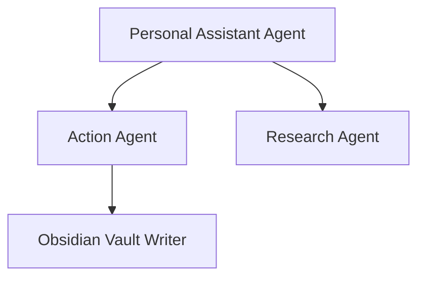

# Obsidian Vault Note Ingestion & Linking

## Instructions

Follow this standard procedure whenever generating, formatting, or updating notes in an Obsidian Vault:

1. **YAML Frontmatter Block**:
   Always begin every markdown file with a valid YAML frontmatter block containing:
   - `title`: Clean human-readable title.
   - `created`: ISO Date string (`YYYY-MM-DD`).
   - `tags`: List of kebab-case taxonomy tags (e.g. `[architecture, notes, fullstack]`).
   - `aliases`: Alternative terms or abbreviations for quick graph searching.

2. **Bi-directional Backlinks (`[[WikiLinks]]`)**:
   - Use `[[TargetNoteName]]` syntax whenever referencing related concepts, architecture components, or entities.
   - Prefer atomic linking over long monolithic paragraphs.

3. **Document Hierarchy**:
   - Use `# Document Title` for the main heading.
   - Use `## Section Name` for core architectural or conceptual divisions.
   - Include a brief `> [!NOTE]` or `> [!TIP]` callout summarizing key takeaways.

4. **Code and Schemas**:
   - Wrap code snippets in language-specific triple backtick fences.
   - Include inline Mermaid diagrams using ` ```mermaid ` when visualizing component relationships.

## Examples

```markdown
---
title: ContextForge Core Architecture
created: 2026-08-21
tags: [architecture, backend, agentic-core]
aliases: [CoreArchitecture, SystemDesign]
---

# ContextForge Core Architecture

> [!NOTE]
> Central intelligence layer coordinating Multi-Agent execution via [[ModelContextProtocol]].

## Component Interaction



## Related Notes
- [[DatabaseSchema]]
- [[EcosystemIntegrations]]
```
