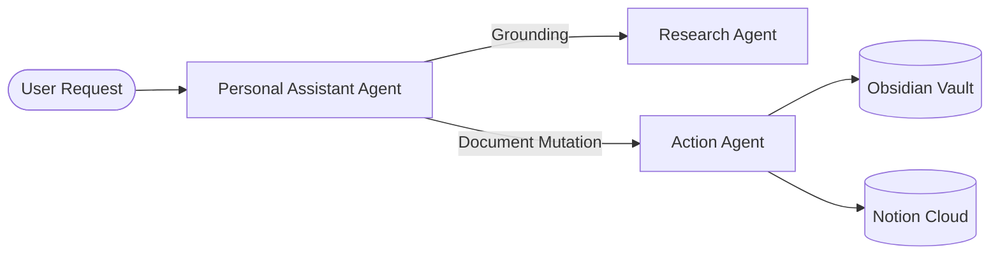

# Architecture RFC & Technical Decision Records

## Instructions

Follow this standard procedure when designing system architectures, drafting RFCs, or documenting major technical changes:

1. **RFC Metadata & Status**:
   - Header must include: RFC Title, Author, Date, Status (`PROPOSED` | `ACCEPTED` | `SUPERSEDED`), and Target Version.

2. **Mandatory Sections Hierarchy**:
   Every technical document must follow this exact section structure:
   - `## 1. Executive Summary & Problem Statement`: Context, motivation, and objectives.
   - `## 2. System Architecture & Component Interaction`: Mermaid diagram visualising data flow.
   - `## 3. Relational & Vector Data Schemas`: SQL DDL table schemas, indexes, and constraints.
   - `## 4. API & Transport Contracts`: REST endpoints, SSE event payloads, or WebSocket message schemas.
   - `## 5. Security, Permissions & Blast Radius`: Read-only vs Sandbox Write boundaries.
   - `## 6. Implementation & Verification Plan`: Actionable breakdown and test strategies.

3. **Mermaid Diagram Quality**:
   - Quote labels containing parentheses or special characters (`id["Label (Info)"]`).
   - Use clean directional arrows (`A -->|Event| B`).

## Examples

```markdown
# RFC-042: Multi-Agent Delegation Architecture

- **Status**: ACCEPTED
- **Date**: 2026-08-21
- **Domain**: Agentic Core / MCP Orchestration

## 1. Executive Summary
Streamline agentic execution into 3 standardized personas: Personal Assistant Agent, Research Agent, and Action Agent.

## 2. Architecture



## 3. SQL DDL Specification
```sql
ALTER TABLE workspace_agents ADD COLUMN IF NOT EXISTS agent_type VARCHAR(30);
```
```
