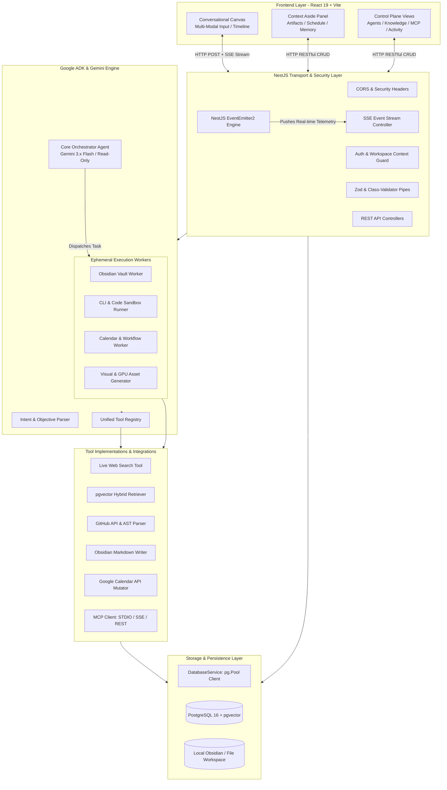
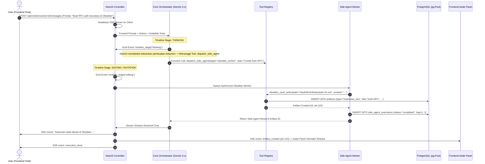

# Technical Design Document (TDD): ContextForge Backend

> **Document Version:** 1.0.0  
> **Status:** Approved Architectural Blueprint  
> **Author:** Principal Backend Architect  
> **Target Framework:** NestJS 11+ · TypeScript 5.7+ · Google GenAI / ADK · Gemini 3.x Flash  
> **Target Database:** PostgreSQL 16+ with `pgvector` (Local Docker ➔ Google Cloud SQL)  
> **Data Access Pattern:** Native SQL via `pg.Pool` (Zero ORM Overhead)

---

## 1. Ringkasan Eksekutif & Tujuan Sistem

**ContextForge** adalah *AI-First Conversational Agentic Workspace* & *Developer Control Plane* modern yang dirancang untuk mengorkestrasi agen kecerdasan buatan, mengintegrasikan multi-sumber pengetahuan (Knowledge Ingestion), mengeksekusi *Side Agents* terisolasi, dan menyediakan antarmuka kerja berdesain editorial yang presisi dan elegan.

Backend ContextForge bertindak sebagai pusat syaraf (*Core Brain & Execution Engine*) yang bertanggung jawab untuk:
1. **Low-Latency Conversational Reasoning:** Memfasilitasi dialog interaktif dengan token streaming berbasis Server-Sent Events (SSE) menggunakan model Gemini 3.x Flash.
2. **Dual-Agent Privilege Separation:** Memisahkan *Core Orchestrator* (reasoning baca-saja / *read-only*) dari *Ephemeral Side Agents* (pekerja mutasi terisolasi / *sandbox write*).
3. **Unified Knowledge Ingestion & Hybrid RAG:** Mengindeks multi-sumber dokumen (Obsidian Vault, GitHub, Notion, OpenAPI, Database Schema) ke dalam PostgreSQL `pgvector` menggunakan model embedding Google `text-embedding-004`.
4. **Interactive Artifact Generation:** Menghasilkan dokumen Markdown, kode diff, event jadwal, dan visual asset yang terhubung langsung secara real-time dengan panel *Context Aside* di frontend.
5. **Real-time Telemetry & Audit Trail:** Melacak setiap tahap eksekusi, pemanggilan tool, verifikasi AST, dan persetujuan pengguna (*Human-In-The-Loop*).

---

## 2. Diagram Arsitektur Tingkat Tinggi (High-Level Architecture)



---

## 3. Keputusan Teknologi & Rationale Arsitektur

| Komponen | Pilihan Teknologi | Rationale & Justifikasi Teknis |
| :--- | :--- | :--- |
| **Backend Framework** | **NestJS 11+** | Menyediakan arsitektur modular enterprise (IoC, Dependency Injection, Guards, Interceptors) dengan dukungan TypeScript penuh. |
| **Reasoning Engine** | **Gemini 3.x Flash** | Latensi inferensi ultra-rendah (*Time-To-First-Token* sangat cepat), native function calling presisi tinggi, context window besar, dan efisien biaya. |
| **Agentic Framework** | **Google ADK / Native `@google/genai`** | Menghilangkan *abstraction bloat* dari LangChain/n8n. Kendali 100% atas alur tool calling, compaction riwayat percakapan, dan event streaming. |
| **Database Relasional & Vector** | **PostgreSQL 16 + `pgvector`** | *Single Data Store*: Menyatukan data relasional transaksional (chat, tasks, artifacts) dan vector embeddings RAG dalam satu database transaksional ACID. |
| **Data Access Layer** | **Native SQL (`pg.Pool`)** | Zero ORM overhead. Fleksibilitas maksimal untuk query vector distance (`<=>`), JSONB functions, dan hybrid search tanpa batasan library ORM. |
| **Embedding Model** | **Google `text-embedding-004`** | Output vektor 768 dimensi dengan akurasi semantik tinggi dan komputasi cosine distance yang sangat cepat pada indeks HNSW. |
| **Realtime Communication** | **Server-Sent Events (SSE)** | Ringan, berbasis HTTP native, auto-reconnection bawaan browser, dan sangat optimal untuk aliran token LLM dan status progress satu arah. |

---

## 4. Alur Detail Agentic Orchestration & Privilege Separation

### 4.1 Prinsip Pemisahan Hak Akses (Dual-Agent Isolation)
1. **Core Orchestrator (Read-Only Mode):**
   - Peran: Bertanggung jawab untuk dialog umum, Q&A, pencarian web, analisis arsitektur, dan memformulasi rencana tugas.
   - Hak Akses: `read_only`. DILARANG melakukan penulisan file, eksekusi terminal, atau mutasi eksternal secara langsung.
2. **Ephemeral Side Agents (Sandbox Write / Full System):**
   - Peran: Dijalankan hanya saat ada instruksi mutasi data nyata (menulis file catatan, mengubah kode sumber, menjadwalkan meeting).
   - Masa Hidup: Bersifat *ephemeral* (dibuat sesuai tugas ➔ dieksekusi ➔ menghasilkan log & artifact ➔ selesai/terminate).
   - Hak Akses: `sandbox_write` (Obsidian, Calendar) atau `full_system` (Code Runner Sandbox).



---

## 5. Arsitektur Hybrid RAG & Multi-Source Knowledge Ingestion

Pencarian konteks cerdas menggabungkan pencarian kemiripan vektor semantik (*Cosine Distance*) dan pencarian kata kunci leksikal (*Full-Text Search*) menggunakan formula gabungan:

$$\text{Relevance Score} = (0.7 \times \text{Semantic Cosine Score}) + (0.3 \times \text{Keyword BM25 Rank})$$

```mermaid
flowchart LR
    subgraph Ingestion_Pipeline [Knowledge Ingestion Flow]
        RawDoc[Raw Docs / Repos / Obsidian] --> TextSplitter[Semantic Recursive Chunker\n500-1000 tokens / 15% overlap]
        TextSplitter --> Embedder[Google text-embedding-004\nTask: RETRIEVAL_DOCUMENT]
        Embedder --> VectorInsert[INSERT INTO knowledge_chunks\nvector(768) + HNSW Index]
    end

    subgraph Query_Pipeline [Hybrid Search Retrieval Flow]
        UserQuery[User Query Prompt] --> QueryEmbedder[Google text-embedding-004\nTask: RETRIEVAL_QUERY]
        QueryEmbedder --> HybridSQL[Native SQL Hybrid Query\nVector Cosine <=> + tsvector FTS]
        HybridSQL --> RelevantContext[Top-K Ranked Context Chunks]
        RelevantContext --> LLMInject[Prompt Context Injection]
    end
```

### Indeks Vektor & Query SQL Standar:
```sql
-- Query Hybrid Search di PostgreSQL:
SELECT 
    c.id,
    c.file_path,
    c.chunk_content,
    c.metadata,
    s.name AS source_name,
    (
        0.7 * (1 - (c.embedding <=> $1::vector)) + 
        0.3 * ts_rank_cd(to_tsvector('indonesian', c.chunk_content), plainto_tsquery('indonesian', $2))
    ) AS relevance_score
FROM knowledge_chunks c
JOIN knowledge_sources s ON c.source_id = s.id
WHERE s.status = 'synced'
ORDER BY relevance_score DESC
LIMIT $3;
```

---

## 6. Spesifikasi Protokol Real-Time Streaming (SSE Contract)

Backend memancarkan event streaming dengan format MIME `text/event-stream`. Setiap event memiliki format standar:

```http
HTTP/1.1 200 OK
Content-Type: text/event-stream
Cache-Control: no-cache
Connection: keep-alive
```

### Tipe Event & Payload Data:

| Nama Event | Payload Schema | Deskripsi & Trigger |
| :--- | :--- | :--- |
| `timeline_stage` | `{ "stage": "thinking" \| "reading" \| "grepping" \| "editing" \| "done", "label": string }` | Mengubah indikator badge warna timeline pada antarmuka chat. |
| `chat_chunk` | `{ "delta": string }` | Token teks tambahan dari Gemini 3.x Flash. |
| `tool_call_start`| `{ "toolName": string, "category": string, "input": object }` | Dipancarkan saat agent mulai mengeksekusi tool. |
| `tool_call_done` | `{ "toolName": string, "durationMs": number, "status": "success" \| "error" }` | Dipancarkan saat pemanggilan tool selesai. |
| `side_agent_log` | `{ "sideAgentId": string, "log": string, "riskLevel": string }` | Log stdout/stderr real-time dari ephemeral worker. |
| `artifact_created`| `{ "id": string, "type": string, "title": string, "locationPath": string }` | Memicu pembukaan otomatis dokumen di Context Aside Panel. |
| `execution_done` | `{ "messageId": string, "totalTokens": number, "durationMs": number }` | Penanda akhir aliran stream obrolan. |
| `error` | `{ "code": string, "message": string }` | Mengirimkan pesan kegagalan secara anggun (*graceful failure*). |

---

## 7. Spesifikasi Kontrak REST API (Endpoints Specification)

Semua endpoint standar mengembalikan payload berstruktur seragam:
```json
{
  "success": true,
  "data": { ... },
  "message": "Operation successful",
  "meta": { "timestamp": "2026-08-19T14:30:00.000Z" }
}
```

### 7.1 Chat & Conversational Canvas (`/api/chat`)
- `GET /api/chat/sessions` ➔ Mengambil semua daftar sesi percakapan.
- `POST /api/chat/sessions` ➔ Membuat sesi percakapan baru.
- `GET /api/chat/sessions/:id` ➔ Mengambil detail sesi beserta seluruh riwayat pesan.
- `DELETE /api/chat/sessions/:id` ➔ Menghapus sesi chat beserta relasinya.
- `POST /api/chat/sessions/:id/messages` ➔ Mengirim pesan teks baru (Mendukung query `?stream=true` untuk Server-Sent Events).
- `POST /api/chat/morning-briefing` ➔ Memicu generator ringkasan pagi proaktif harian.

### 7.2 Context Aside & Artifacts (`/api/artifacts`)
- `GET /api/artifacts` ➔ Mengambil daftar seluruh dokumen/diff/visual asset.
- `GET /api/artifacts/:id` ➔ Mengambil detail isi dokumen artifact.
- `PUT /api/artifacts/:id` ➔ Memperbarui konten dokumen (saat user mengedit di Aside Panel).
- `DELETE /api/artifacts/:id` ➔ Menghapus artifact.

### 7.3 Personal Hub: Calendar & Memories (`/api/personal-hub`)
- `GET /api/personal-hub/calendar` ➔ Mengambil daftar kegiatan agenda kalender.
- `POST /api/personal-hub/calendar` ➔ Membuat kegiatan kalender baru.
- `PATCH /api/personal-hub/calendar/:id/status` ➔ Memperbarui status event (`upcoming` / `in_progress` / `completed`).
- `GET /api/personal-hub/memories` ➔ Mengambil memori jangka panjang pengguna.
- `POST /api/personal-hub/memories` ➔ Menambah memori baru (otomatis di-embed ke vektor).
- `DELETE /api/personal-hub/memories/:id` ➔ Menghapus item memori.

### 7.4 Multi-Source Knowledge (`/api/knowledge`)
- `GET /api/knowledge/sources` ➔ Mengambil daftar sumber pengetahuan terhubung.
- `POST /api/knowledge/sources` ➔ Mendaftarkan sumber pengetahuan baru (Obsidian/GitHub/Notion).
- `POST /api/knowledge/sources/:id/sync` ➔ Memulai proses background sync & re-indexing vector.
- `DELETE /api/knowledge/sources/:id` ➔ Menghapus sumber pengetahuan dan seluruh chunks-nya (Cascade).

### 7.5 Agent Roster & Integrations (`/api/ecosystem`)
- `GET /api/ecosystem/agents` ➔ Mengambil daftar konfigurasi agen.
- `PATCH /api/ecosystem/agents/:id` ➔ Mengubah prompt sistem, temperature, atau permission tier.
- `GET /api/ecosystem/skills` ➔ Mengambil daftar katalog Standard Operating Procedure (SOP) Skills.
- `PATCH /api/ecosystem/skills/:id/toggle` ➔ Mengaktifkan/menonaktifkan skill.
- `GET /api/ecosystem/integrations` ➔ Mengambil status server MCP Connectors.

### 7.6 Activity Telemetry (`/api/activity`)
- `GET /api/activity/logs` ➔ Mengambil log telemetri terfilter (dengan pagination).
- `GET /api/activity/export` ➔ Mengunduh data audit trail dalam format `contextforge_activity_audit.json`.

---

## 8. Arsitektur Data Access Layer (Native SQL & Connection Management)

Tanpa ORM, data access layer dienkapsulasi menggunakan pola **Repository Pattern** di atas service terpadu **`DatabaseService`**:

```typescript
// src/common/database/database.service.ts
import { Injectable, OnModuleInit, OnModuleDestroy, Logger } from '@nestjs/common';
import { Pool, QueryResult, QueryResultRow } from 'pg';
import { ConfigService } from '@nestjs/config';

@Injectable()
export class DatabaseService implements OnModuleInit, OnModuleDestroy {
  private pool: Pool;
  private readonly logger = new Logger(DatabaseService.name);

  constructor(private readonly config: ConfigService) {}

  async onModuleInit() {
    this.pool = new Pool({
      connectionString: this.config.get<string>('DATABASE_URL'),
      max: 20, // Max concurrent connection pool
      idleTimeoutMillis: 30000,
      connectionTimeoutMillis: 5000,
    });

    try {
      const client = await this.pool.connect();
      this.logger.log('🚀 Connected to PostgreSQL database successfully');
      client.release();
    } catch (err) {
      this.logger.error('❌ Failed to connect to PostgreSQL database', err.stack);
    }
  }

  async query<T extends QueryResultRow = any>(text: string, params?: any[]): Promise<QueryResult<T>> {
    const start = Date.now();
    const res = await this.pool.query<T>(text, params);
    const duration = Date.now() - start;
    if (duration > 200) {
      this.logger.warn(`⚠️ Slow query (${duration}ms): ${text.slice(0, 100)}...`);
    }
    return res;
  }

  async transaction<T>(callback: (client: any) => Promise<T>): Promise<T> {
    const client = await this.pool.connect();
    try {
      await client.query('BEGIN');
      const result = await callback(client);
      await client.query('COMMIT');
      return result;
    } catch (e) {
      await client.query('ROLLBACK');
      throw e;
    } finally {
      client.release();
    }
  }

  async onModuleDestroy() {
    await this.pool.end();
  }
}
```

---

## 9. Struktur Folder & Modul NestJS (Definitive Blueprint)

```text
backend/
├── docs/
│   ├── ERD.md                            # Entity Relationship Diagram & SQL DDL
│   └── TDD.md                            # Technical Design Document (File ini)
│
├── src/
│   ├── main.ts                           # Entrypoint aplikasi (Bootstrap, CORS, Global Pipes)
│   ├── app.module.ts                     # Root Module agregator
│   │
│   ├── config/                           # Konfigurasi Environment (Zod validated)
│   │   ├── env.validation.ts
│   │   ├── database.config.ts
│   │   └── gemini.config.ts
│   │
│   ├── common/                           # Cross-cutting concerns & utilitas
│   │   ├── database/                     # Native pg.Pool DatabaseModule & Service
│   │   │   ├── database.module.ts
│   │   │   └── database.service.ts
│   │   ├── filters/                      # GlobalExceptionFilter (RFC 7807)
│   │   ├── guards/                       # HitlGuard, ApiKeyGuard
│   │   ├── interceptors/                 # TransformResponse, LoggingInterceptor
│   │   └── pipes/                        # ZodValidationPipe
│   │
│   ├── modules/                          # Modul Domain Bisnis (Feature-Sliced)
│   │   ├── chat/                         # Chat Engine & SSE Stream
│   │   │   ├── chat.controller.ts
│   │   │   ├── chat.service.ts
│   │   │   ├── chat.repository.ts
│   │   │   └── dto/
│   │   ├── artifacts/                    # Context Aside Artifacts Management
│   │   │   ├── artifacts.controller.ts
│   │   │   ├── artifacts.service.ts
│   │   │   └── artifacts.repository.ts
│   │   ├── personal-hub/                 # Calendar & User Long-Term Memories
│   │   │   ├── personal-hub.controller.ts
│   │   │   ├── personal-hub.service.ts
│   │   │   └── personal-hub.repository.ts
│   │   ├── knowledge/                    # Multi-Source Ingestion & Chunker
│   │   │   ├── knowledge.controller.ts
│   │   │   ├── knowledge.service.ts
│   │   │   ├── knowledge.repository.ts
│   │   │   └── chunking.service.ts
│   │   ├── ecosystem/                    # Agents Roster, Skills, Plugins & MCP
│   │   │   ├── ecosystem.controller.ts
│   │   │   └── ecosystem.service.ts
│   │   └── activity/                     # Telemetry Streamer & Audit Exporter
│   │       ├── activity.controller.ts
│   │       ├── activity.service.ts
│   │       └── activity.repository.ts
│   │
│   ├── agentic-core/                     # 🧠 Google ADK & Gemini Reasoning Engine
│   │   ├── agentic-core.module.ts
│   │   ├── gemini-client.provider.ts     # Inisialisasi Google GenAI SDK Client
│   │   ├── orchestrator/                 # Core Orchestrator Loop & Reasoning
│   │   │   └── core-orchestrator.service.ts
│   │   ├── side-agents/                  # Ephemeral Workers Runner
│   │   │   ├── obsidian-worker.service.ts
│   │   │   ├── code-sandbox-worker.service.ts
│   │   │   ├── calendar-worker.service.ts
│   │   │   └── visual-worker.service.ts
│   │   ├── embeddings/                   # Embedding Service (text-embedding-004)
│   │   │   └── embedding.service.ts
│   │   └── prompts/                      # System Prompts & Skill SOP Templates
│   │       ├── orchestrator.prompt.ts
│   │       └── workers.prompt.ts
│   │
│   └── tools/                            # 🛠️ Unified Tool Registry & Implementations
│       ├── tool-registry.module.ts
│       ├── tool-registry.service.ts
│       ├── search/                       # Live Web Search Tool
│       ├── knowledge/                    # Vector Hybrid Search Tool
│       ├── obsidian/                     # Obsidian Vault Writer Tool
│       ├── calendar/                     # Calendar Scheduler Tool
│       └── git/                          # Git & Diff Tool
│
├── database/                             # Migrations & Seeders
│   ├── schema.sql                        # Skrip inisialisasi DDL PostgreSQL
│   └── seeds/                            # Initial seed data (Default Agents, Skills)
│       └── seed.sql
│
├── test/                                 # Unit & E2E Tests
│   ├── chat.e2e-spec.ts
│   └── rag.spec.ts
│
├── .env.example                          # Template konfigurasi environment
├── package.json
└── tsconfig.json
```

---

## 10. Keamanan, Guardrails & Human-in-the-Loop (HITL)

1. **Strict HITL Mode Enforcement:**
   - Ketika mode *Strict HITL* aktif di pengaturan (`settings`), setiap eksekusi Side Agent dengan tingkat risiko `high_risk` (seperti penghapusan file, eksekusi perintah shell berbahaya, atau push git) akan dipause dengan status `waiting_approval`.
   - Backend memancarkan notifikasi persetujuan ke frontend dan menunggu verifikasi eksplisit sebelum melanjutkan proses.
2. **AST (Abstract Syntax Tree) Verification:**
   - Sebelum kode sumber diterapkan ke repository atau dijadikan file diff, tool `code_ast_checker` melakukan parsing AST untuk memastikan tidak ada kesalahan sintaksis atau ekspresi berbahaya.
3. **Prompt Injection Shielding:**
   - Karena Core Orchestrator berjalan dalam status *Read-Only*, injeksi prompt berbahaya dari data web tidak dapat memicu perintah terminal secara langsung.

---

## 11. Roadmap Pengembangan Step-by-Step

```
┌─────────────────────────────────────────────────────────────────────────────┐
│                       TAHAPAN PENGEMBANGAN BACKEND                          │
├─────────────────────────────────────────────────────────────────────────────┤
│                                                                             │
│  [FASE 1: Fondasi & Database Core]                                          │
│  ├── 1.1 Setup Docker PostgreSQL 16 + pgvector di lokal                     │
│  ├── 1.2 Eksekusi database/schema.sql & inisialisasi seed data              │
│  ├── 1.3 Setup DatabaseModule (pg.Pool) & Health Check Controller          │
│  └── 1.4 Implementasi CRUD dasar: Artifacts & Personal Hub (Calendar/Memory)│
│                                                                             │
│  [FASE 2: Google GenAI Core & Conversational Streaming]                     │
│  ├── 2.1 Konfigurasi Gemini 3.x Flash Provider (@google/genai SDK)          │
│  ├── 2.2 Implementasi Chat Controller & SSE Streaming Pipeline              │
│  ├── 2.3 Implementasi Tool Calling Loop & Function Declarations             │
│  └── 2.4 Sinkronisasi otomatis ke Aside Panel via Event Stream              │
│                                                                             │
│  [FASE 3: Side-Agents Execution & Multi-Source RAG]                         │
│  ├── 3.1 Embedding Service (Google text-embedding-004)                      │
│  ├── 3.2 Ingestion Chunker & Hybrid Search SQL Repository                   │
│  ├── 3.3 Ephemeral Workers (Obsidian, Code Runner, Calendar Scheduler)      │
│  └── 3.4 Telemetry Streamer & Audit Log JSON Exporter                       │
│                                                                             │
│  [FASE 4: Verifikasi, Testing & Integrasi Frontend]                         │
│  ├── 4.1 Unit Testing untuk Tool Registry & Agentic Loop                    │
│  ├── 4.2 E2E Integration Testing dengan Frontend React 19                   │
│  └── 4.3 Kesiapan Deploy ke Google Cloud (Cloud Run + Cloud SQL)            │
│                                                                             │
└─────────────────────────────────────────────────────────────────────────────┘
```

---

## 12. Persetujuan & Langkah Lanjutan

Dokumen **Technical Design Document (TDD)** ini menetapkan seluruh standar, arsitektur, dan pola implementasi teknis untuk ContextForge. Seluruh pengembangan kode backend berikutnya akan merujuk secara ketat pada spesifikasi ini.
