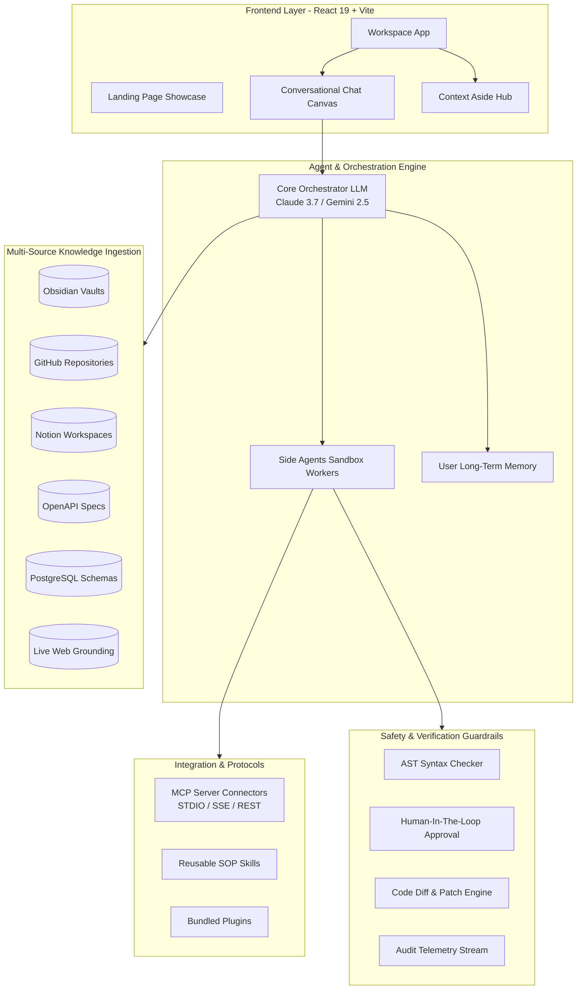

# Dokumentasi Teknis & Panduan Arsitektur: ContextForge

> **ContextForge** adalah platform *AI-First Conversational Agentic Workspace* & *Developer Control Plane* modern yang dirancang untuk mengorkestrasi agen kecerdasan buatan, mengintegrasikan multi-sumber pengetahuan (Knowledge Ingestion), mengeksekusi *Side Agents* terisolasi, dan menyediakan antarmuka kerja berdesain editorial yang presisi dan elegan.

---

## Daftar Isi
1. [Ringkasan Eksekutif & Visi Proyek](#1-ringkasan-eksekutif--visi-proyek)
2. [Arsitektur Sistem & Prinsip Desain](#2-arsitektur-sistem--prinsip-desain)
3. [Fitur Utama & Modul Fungsional](#3-fitur-utama--modul-fungsional)
   - [3.1 Conversational Canvas & Interactive Chat](#31-conversational-canvas--interactive-chat)
   - [3.2 Context Aside & Personal Hub (Artifacts, Memory, Schedule)](#32-context-aside--personal-hub-artifacts-memory-schedule)
   - [3.3 Multi-Agent Orchestration & Ephemeral Workers](#33-multi-agent-orchestration--ephemeral-workers)
   - [3.4 Multi-Source Knowledge Ingestion](#34-multi-source-knowledge-ingestion)
   - [3.5 Integrations, MCP Connectors, Skills & Plugins](#35-integrations-mcp-connectors-skills--plugins)
   - [3.6 Guardrails, HITL (Human-in-the-Loop) & Verifikasi AST](#36-guardrails-hitl-human-in-the-loop--verifikasi-ast)
   - [3.7 Activity Telemetry & Audit Trail](#37-activity-telemetry--audit-trail)
   - [3.8 Settings & Model Configurations](#38-settings--model-configurations)
   - [3.9 Landing Page & Showcase](#39-landing-page--showcase)
4. [Tech Stack & Pustaka Dependensi](#4-tech-stack--pustaka-dependensi)
5. [Struktur Direktori Proyek](#5-struktur-direktori-proyek)
6. [Design System & Estetika Antarmuka](#6-design-system--estetika-antarmuka)
7. [Panduan Instalasi & Menjalankan Aplikasi](#7-panduan-instalasi--menjalankan-aplikasi)

---

## 1. Ringkasan Eksekutif & Visi Proyek

Saat ini, developer dan knowledge worker bekerja dengan konteks yang terfragmentasi di berbagai tempat:
- Catatan pribadi di **Obsidian Vault** / Markdown
- Kode sumber dan Pull Request di **GitHub**
- Dokumentasi tim di **Notion**
- Spesifikasi API di **OpenAPI / Swagger**
- Skema data di **PostgreSQL / Database**
- Kalender dan pengingat di **Google Calendar**
- Pencarian data terkini di **Live Web Search**

**ContextForge** hadir sebagai *single unified agentic control plane* yang menyatukan seluruh sumber konteks tersebut. Melalui pendekatan **Multi-Agent Orchestration**, ContextForge membagi tugas antara:
1. **Core Orchestrator**: Agen penalar utama yang berdialog, menganalisis masalah, melakukan pencarian web langsung, dan menyusun rencana kerja.
2. **Ephemeral Side Agents**: Pekerja mandiri yang dijalankan dalam sandbox aman untuk melakukan mutasi data nyata (menulis catatan Obsidian, menjalankan perintah CLI/terminal, membuat PR GitHub, mengatur jadwal kalender, atau membuat aset visual).

---

## 2. Arsitektur Sistem & Prinsip Desain

ContextForge dibangun di atas 4 pilar arsitektur utama:



### Prinsip Utama:
- **Separation of Reasoning & Execution**: Agen penalar utama berjalan secara *read-only* untuk mencegah halusinasi berbahaya. Seluruh aksi mutasi didelegasikan ke *Side Agents* dengan hak akses terkontrol.
- **Strict Human-in-the-Loop (HITL)**: Tindakan berisiko tinggi (seperti menghapus file, menulis ke sistem produksi, atau mengeksekusi skrip CLI) memerlukan persetujuan eksplisit pengguna.
- **Verifiable Artifacts**: Setiap output pekerjaan agen berupa *Artifact* nyata (dokumen Markdown, patch diff, event kalender, sintesis riset) yang dapat dilihat, disunting, diunduh, dan dilacak.
- **Editorial Clean Aesthetic**: Mengadopsi bahasa desain warm-editorial (terinspirasi dari estetika Cursor) dengan latar *warm cream*, tipografi tajam, dan visualisasi timeline status yang intuitif.

---

## 3. Fitur Utama & Modul Fungsional

### 3.1 Conversational Canvas & Interactive Chat
- **Multi-Modal Input Box**: Mendukung input teks multi-line otomatis, *Speech-to-Text / Voice input simulation*, *Slash commands* (`/`), dan *Agent mentions* (`@`).
- **Interactive Action Cards**: Menampilkan hasil tindakan cerdas seperti:
  - *Obsidian Note Card*: Ringkasan catatan yang dibuat, status sync, dan tombol buka langsung.
  - *Calendar Reminder Card*: Detail jadwal rapat atau tugas dengan status badge.
  - *Live Web Search Summary*: Sintesis pencarian dengan domain sumber terverifikasi.
  - *Git PR & Code Diff*: Tinjauan perubahan kode dengan metrik baris penambahan/pengurangan.
  - *AI Image Rendering*: Preview visual aset yang dihasilkan model Imagen.
- **Live AI Timeline Status**: Indikator tahap eksekusi bertingkat (*Thinking* ➔ *Reading* ➔ *Grepping* ➔ *Editing* ➔ *Done*).
- **Morning Briefing Generator**: Tombol aksi cepat untuk membangkitkan ringkasan pagi harian (jadwal kalender, prioritas backlog, dan cuaca).

### 3.2 Context Aside & Personal Hub (Artifacts, Memory, Schedule)
Panel samping multi-tab yang selalu siap diakses di seluruh alur kerja:
1. **Artifacts Tab**:
   - Preview dokumen aktif dengan *Markdown Renderer*.
   - Mode editor langsung (*Live Edit Mode*) dengan tombol simpan.
   - Fitur salin ke clipboard dan unduh file `.md`.
2. **Schedule Tab**:
   - Daftar agenda dan jadwal hari ini.
   - Form pembuatan event baru (kategori rapat, review, tugas personal).
   - Toggle status event (*upcoming*, *in-progress*, *completed*).
3. **Memories Tab**:
   - Penyimpanan memori jangka panjang pengguna (*Profile*, *Preferences*, *Project Context*, *Workflow Rules*).
   - Penambahan dan penghapusan item memori secara mandiri.

### 3.3 Multi-Agent Orchestration & Ephemeral Workers
Katalog agen dengan spesialisasi tugas dan permission tier masing-masing:
- **Core Orchestrator**: Reasoning umum, sintesis multi-sumber, delegasi tugas.
- **Obsidian Vault Worker** (`sandbox_write`): Menulis dan memformat catatan markdown ke vault lokal.
- **CLI & Code Sandbox Runner** (`full_system`): Menjalankan perintah terminal, pengujian unit, pembuatan patch diff.
- **Calendar & Workflow Worker** (`sandbox_write`): Mengatur event Google Calendar dan webhook mutasi API.
- **Visual & Asset Generator** (`sandbox_write`): Merender diagram arsitektur dan mockup UI.
- *Fitur Inspector Modal*: Konfigurasi prompt sistem, suhu (temperature), model LLM, dan riwayat performa.

### 3.4 Multi-Source Knowledge Ingestion
Manajemen integrasi data pengetahuan eksternal:
- **Tipe Sumber**: Obsidian Vault, GitHub Repositories, Notion Workspace, OpenAPI Spec, Database Schema (PostgreSQL), Web Crawl Engine.
- **Metrik Real-Time**: Status sinkronisasi (*synced*, *syncing*, *error*), jumlah file terindeks, total vector chunks, waktu sinkronisasi terakhir.
- **Source Inspector Modal**: Detail lokasi path, konfigurasi auto-sync, dan pemicu manual sync.

### 3.5 Integrations, MCP Connectors, Skills & Plugins
Modul ekstensibilitas berbasis standar **Model Context Protocol (MCP)**:
- **Connectors**: Server integrasi MCP (mendukung transport STDIO, SSE, dan REST), lengkap dengan daftar tool schemas, parameter schema inspector, indikator latensi milidetik, dan tombol test connection.
- **Skills (SOP Modules)**: Prosedur operasional terstandarisasi untuk AI (TDD Flow, CVE Threat Modeling, Obsidian Note Synthesis, RFC Architecture Drafting, PostgreSQL Schema Analyzer).
- **Plugins Ecosystem**: Paket bundle berisi konektor dan skill tematik (Engineering, Security, DevOps, Productivity) dengan opsi instalasi sekali klik.

### 3.6 Guardrails, HITL (Human-in-the-Loop) & Verifikasi AST
- **Checkpoint Verifikasi Otomatis**: Analisis AST (Abstract Syntax Tree), verifikasi unit test, pemindaian kerentanan CVE, dan kepatuhan RFC.
- **Safety Enforcement**: Menolak eksekusi mutasi yang belum mendapatkan persetujuan pengguna pada mode *Strict HITL*.
- **Visual Diff Viewer**: Perbandingan baris kode sebelum dan sesudah perubahan secara terperinci.

### 3.7 Activity Telemetry & Audit Trail
- **Log Aktivitas Lengkap**: Melacak setiap tindakan agen (`task_dispatched`, `tool_invoked`, `ast_verified`, `human_approved`, `obsidian_note_created`, `reminder_created`, `web_searched`, dll.).
- **Filtering & Audit Export**: Filter berbasis tipe aksi dan tombol export data audit ke file JSON (`contextforge_activity_audit.json`).

### 3.8 Settings & Model Configurations
- **LLM Model Selection**: Pilihan model default (Claude 3.7 Sonnet, Gemini 2.5 Flash, Claude 3.5 Sonnet, OpenAI GPT-4o).
- **Sampling Temperature**: Slider kontrol dari deterministik (0.0 untuk coding) hingga kreatif (1.0).
- **Kebijakan Keamanan**: Saklar toggle untuk *Strict HITL Enforcement*, *AST Sandboxing*, dan ambang batas token budget.

### 3.9 Landing Page & Showcase
- Halaman beranda interaktif untuk memamerkan kapabilitas platform:
  - Hero section dengan visualisasi live session.
  - Bento grid sumber pengetahuan.
  - Alur visualisasi agen bekerja (*Agent Workflow Walkthrough*).
  - Metrik performa dan keandalan sistem.
  - FAQ interaktif dan Call-to-Action.

---

## 4. Tech Stack & Pustaka Dependensi

| Kategori | Teknologi | Deskripsi |
| :--- | :--- | :--- |
| **Framework Utama** | React 19 (`^19.2.8`) | Library antarmuka modern dengan performa tinggi |
| **Bahasa Pemrograman** | TypeScript (`~6.0.2`) | Static typing yang ketat dan aman |
| **Build Tool & Bundler** | Vite 8 (`^8.2.0`) | Tooling build ultra-cepat dengan Hot Module Replacement (HMR) |
| **Styling & CSS** | Tailwind CSS v4 (`^4.3.3`) | Utility-first CSS engine dengan konfigurasi tema modern |
| **Routing** | React Router v7 (`^7.18.2`) | Client-side routing dengan lazy loading / code splitting |
| **Animasi & Transisi** | Motion (`^13.1.0`) | Library animasi deklaratif untuk transisi UI yang halus |
| **Ikonografi** | Lucide React & React Icons | Set ikon modern dan konsisten |
| **Markdown Rendering** | React Markdown + Remark GFM | Render dokumen Markdown, tabel GFM, dan blok kode |
| **State & Context** | React Context API | Manajemen state terpusat (`WorkspaceContext`) yang reaktif |

---

## 5. Struktur Direktori Proyek

```text
frontend/
├── docs/
│   ├── DESIGN-cursor.md          # Spesifikasi desain & token visual
│   └── PROJECT_DOCUMENTATION.md  # Dokumentasi komprehensif sistem (file ini)
├── public/                       # Aset statis publik
├── src/
│   ├── App.tsx                   # Konfigurasi routing utama & WorkspaceProvider
│   ├── index.css                 # Style global, variabel CSS, & tema Tailwind v4
│   ├── main.tsx                  # Entry point React DOM
│   │
│   ├── features/                 # Modul-modul fitur modular (Feature-Sliced Design)
│   │   ├── activity/             # Telemetri & audit trail aktivitas
│   │   │   ├── components/       # Header, filter bar, activity list items
│   │   │   └── views/            # ActivityView.tsx
│   │   ├── agents/               # Direktori agen & manajemen kemampuan
│   │   │   ├── components/       # AgentCard, AgentInspectorModal, RosterHeader
│   │   │   └── views/            # AgentsDirectoryView.tsx
│   │   ├── dashboard/            # Workspace utama (Chat canvas & Aside hub)
│   │   │   ├── components/       # DashboardChatCanvas, DashboardContextAside, Sidebar, Header
│   │   │   └── views/            # DashboardView.tsx
│   │   ├── home/                 # Komponen landing page showcase
│   │   │   ├── components/       # Hero, Bento, Workflow, TrustMetrics, FAQ, CTA
│   │   │   └── views/            # HomeView.tsx
│   │   ├── integrations/         # MCP Connectors, Skills SOP, & Plugins
│   │   │   ├── components/       # Connectors, Skills, Plugins, Add modals, Drawers
│   │   │   └── views/            # IntegrationsView.tsx
│   │   ├── knowledge/            # Manajemen sumber data pengetahuan
│   │   │   ├── components/       # KnowledgeSourceCard, AddSourceModal, DetailModal
│   │   │   └── views/            # KnowledgeSourcesView.tsx
│   │   └── settings/             # Konfigurasi model & guardrails
│   │       └── views/            # SettingsView.tsx
│   │
│   ├── pages/                    # Entry page wrappers (HomePage.tsx, etc.)
│   └── shared/                   # Komponen, layout, tipe data, & utilitas bersama
│       ├── components/           # MarkdownRenderer, GlobalToast, Modal wrappers
│       ├── layouts/              # DashboardLayout, WorkspaceLayout, HomeLayout
│       ├── mock/                 # Mock state engine, WorkspaceContext, useWorkspace hook
│       ├── types/                # Definisi TypeScript domain (workspace.ts)
│       └── utils/                # Helper formatting & date utilities
│
├── eslint.config.js              # Konfigurasi linter ESLint
├── package.json                  # Dependensi dan skrip proyek
├── tsconfig.json                 # Konfigurasi TypeScript root
└── vite.config.ts                # Konfigurasi Vite & path alias (`@/`)
```

---

## 6. Design System & Estetika Antarmuka

ContextForge menggunakan skema warna dan tipografi warm-editorial yang dirancang untuk kenyamanan visual developer:

- **Canvas Background**: `#f7f7f4` (Warm Cream Canvas) / `#fafaf7` (Soft Canvas)
- **Primary Accent**: `#f54e00` (Cursor Voltage Orange) & `#d04200` (Active state)
- **Ink / Typography**: `#26251e` (Near-Black Warm Ink) & `#5a5852` (Body muted text)
- **Hairline Borders**: `#e6e5e0` / `#efeee8` (Subtle boundary dividers)
- **AI Timeline Pastel Badges**:
  - `Thinking`: `#dfa88f` (Warm Peach)
  - `Reading / Context`: `#9fbbe0` (Soft Blue)
  - `Grepping / Index`: `#9fc9a2` (Mint Green)
  - `Editing / Mutation`: `#c0a8dd` (Lavender)
  - `Done / Validated`: `#c08532` (Gold)

---

## 7. Panduan Instalasi & Menjalankan Aplikasi

### Prasyarat:
- **Node.js** versi 18.0 atau yang lebih baru
- **npm** (atau pnpm / yarn)

### Langkah-langkah:

1. **Clone repository & masuk ke direktori frontend**:
   ```bash
   cd frontend
   ```

2. **Install dependensi**:
   ```bash
   npm install
   ```

3. **Jalankan server pengembangan (Dev Server)**:
   ```bash
   npm run dev
   ```
   Aplikasi akan berjalan di `http://localhost:5173`.

4. **Menjalankan Build Produksi**:
   ```bash
   npm run build
   ```
   Hasil build siap saji akan dibuat di folder `dist/`.

5. **Menjalankan Linting**:
   ```bash
   npm run lint
   ```

---

## 8. Ringkasan & Roadmap Masa Depan
Proyek **ContextForge** telah siap digunakan dengan antarmuka yang sangat responsif, sistem simulasi eksekusi agen yang komprehensif, manajemen sumber data terpadu, dan arsitektur kode modular berbasis fitur yang mudah dikembangkan untuk integrasi backend sesungguhnya (FastAPI / Node.js / MCP Host Server).
